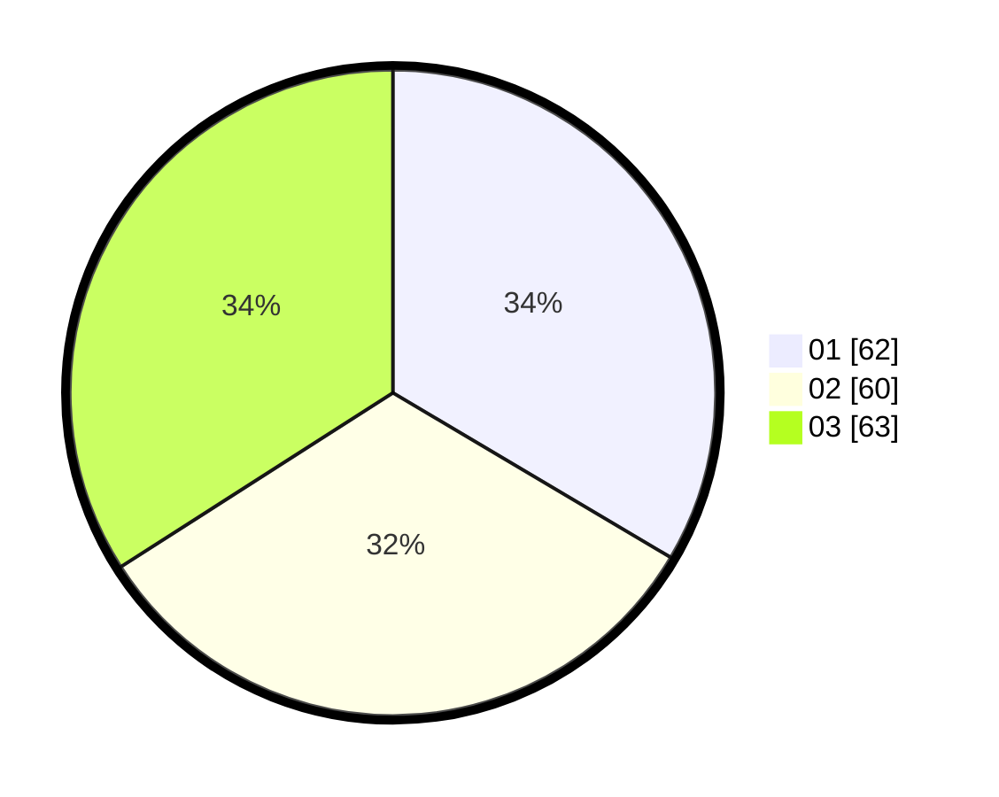

# Hasil

Hasil perolehan suara paslon dapat dilihat pada file paslon-01.txt, paslon-02.txt, dan paslon-03.txt.

Jika tidak ada, artinya data tersebut belum ada pada SIREKAP.

## Perolehan Suara

 * Paslon 01: **62**.
 * Paslon 02: **60**.
 * Paslon 03: **63**.

## Foto C Plano

https://sirekap-obj-formc.kpu.go.id/6785/pemilu/ppwp/31/73/02/10/03/3173021003050-20240214-200414--89f903ee-3d93-42ee-b4b0-eacc4dee62e0.jpg

https://sirekap-obj-formc.kpu.go.id/6785/pemilu/ppwp/31/73/02/10/03/3173021003050-20240214-195944--a2a7d67e-4151-4713-a804-bd602da2b5e2.jpg

https://sirekap-obj-formc.kpu.go.id/6785/pemilu/ppwp/31/73/02/10/03/3173021003050-20240214-200104--5d5e57da-0455-409d-a0f8-3e07fe9b7602.jpg
