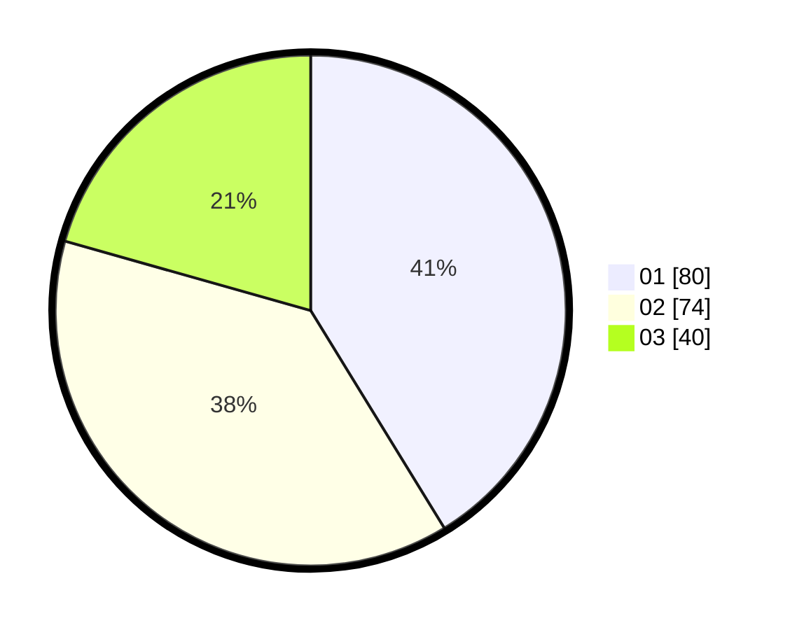

# Hasil

Hasil perolehan suara paslon dapat dilihat pada file paslon-01.txt, paslon-02.txt, dan paslon-03.txt.

Jika tidak ada, artinya data tersebut belum ada pada SIREKAP.

## Perolehan Suara

 * Paslon 01: **80**.
 * Paslon 02: **74**.
 * Paslon 03: **40**.

## Foto C Plano

https://sirekap-obj-formc.kpu.go.id/a076/pemilu/ppwp/31/73/02/10/03/3173021003052-20240216-190409--8eeb732c-17e4-47e0-ad14-2a7b4487b7fa.jpg

https://sirekap-obj-formc.kpu.go.id/a076/pemilu/ppwp/31/73/02/10/03/3173021003052-20240216-190410--78e844d0-7911-41d3-a311-ea88a5140526.jpg

https://sirekap-obj-formc.kpu.go.id/a076/pemilu/ppwp/31/73/02/10/03/3173021003052-20240216-190409--b8e0d64a-7a5a-4342-8a4e-0c3a48e39c00.jpg

## DATA PEMILIH TETAP

Jumlah pemilih dalam DPT: **261**.
 * L: **137**.
 * P: **124**.

## DATA PENGGUNA HAK PILIH

Jumlah pengguna hak pilih dalam DPT: **190**.
 * L: **94**.
 * P: **96**.

Jumlah pengguna hak pilih dalam DPTb: **9**.
 * L: **4**.
 * P: **5**.

Jumlah pengguna hak pilih dalam DPK: **0**.
 * L: **0**.
 * P: **0**.

Jumlah pengguna hak pilih: **199**.
 * L: **98**.
 * P: **101**.

## JUMLAH SUARA SAH DAN TIDAK SAH

JUMLAH SELURUH SUARA SAH: **194**.

JUMLAH SUARA TIDAK SAH: **5**.

JUMLAH SELURUH SUARA SAH DAN SUARA TIDAK SAH: **199**.
