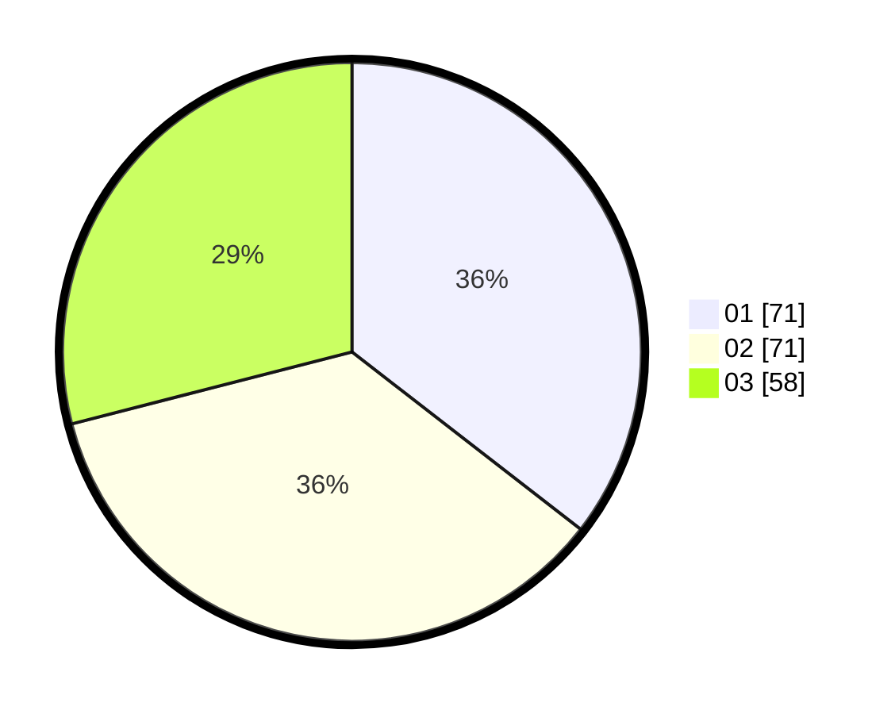

# Hasil

Hasil perolehan suara paslon dapat dilihat pada file paslon-01.txt, paslon-02.txt, dan paslon-03.txt.

Jika tidak ada, artinya data tersebut belum ada pada SIREKAP.

## Perolehan Suara

 * Paslon 01: **71**.
 * Paslon 02: **71**.
 * Paslon 03: **58**.

## Foto C Plano

https://sirekap-obj-formc.kpu.go.id/160b/pemilu/ppwp/31/73/02/10/03/3173021003053-20240216-054106--3f98cd0f-d95a-4724-a56a-a51deea0f314.jpg

https://sirekap-obj-formc.kpu.go.id/160b/pemilu/ppwp/31/73/02/10/03/3173021003053-20240216-054120--385a7eb8-fa7e-41ec-8a13-5a76016069d3.jpg

https://sirekap-obj-formc.kpu.go.id/160b/pemilu/ppwp/31/73/02/10/03/3173021003053-20240216-180220--ac4cbfbd-a1eb-450f-b898-0a5f481bdb49.jpg

## DATA PEMILIH TETAP

Jumlah pemilih dalam DPT: **269**.
 * L: **139**.
 * P: **130**.

## DATA PENGGUNA HAK PILIH

Jumlah pengguna hak pilih dalam DPT: **197**.
 * L: **99**.
 * P: **98**.

Jumlah pengguna hak pilih dalam DPTb: **7**.
 * L: **1**.
 * P: **6**.

Jumlah pengguna hak pilih dalam DPK: **1**.
 * L: **1**.
 * P: **0**.

Jumlah pengguna hak pilih: **205**.
 * L: **101**.
 * P: **104**.

## JUMLAH SUARA SAH DAN TIDAK SAH

JUMLAH SELURUH SUARA SAH: **200**.

JUMLAH SUARA TIDAK SAH: **5**.

JUMLAH SELURUH SUARA SAH DAN SUARA TIDAK SAH: **205**.
