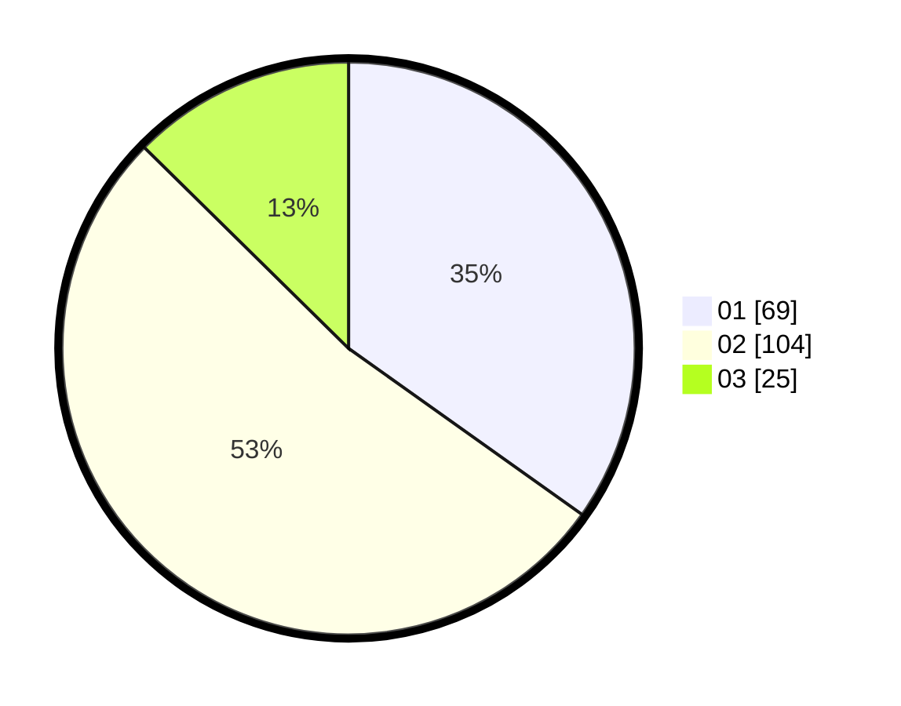

# Hasil

Hasil perolehan suara paslon dapat dilihat pada file paslon-01.txt, paslon-02.txt, dan paslon-03.txt.

Jika tidak ada, artinya data tersebut belum ada pada SIREKAP.

## Perolehan Suara

 * Paslon 01: **69**.
 * Paslon 02: **104**.
 * Paslon 03: **25**.

## Foto C Plano

https://sirekap-obj-formc.kpu.go.id/81fc/pemilu/ppwp/31/73/02/10/03/3173021003055-20240217-171008--6550d8d5-a982-46ab-b3f7-2e2d95dc9c7b.jpg

https://sirekap-obj-formc.kpu.go.id/81fc/pemilu/ppwp/31/73/02/10/03/3173021003055-20240217-171009--2058f9c5-56a9-4ab7-b4b0-9bfcbf17e0f1.jpg

https://sirekap-obj-formc.kpu.go.id/81fc/pemilu/ppwp/31/73/02/10/03/3173021003055-20240217-171009--b11ebf12-c405-4016-86bc-b573ef6ae0e5.jpg

## DATA PEMILIH TETAP

Jumlah pemilih dalam DPT: **260**.
 * L: **125**.
 * P: **135**.

## DATA PENGGUNA HAK PILIH

Jumlah pengguna hak pilih dalam DPT: **193**.
 * L: **90**.
 * P: **103**.

Jumlah pengguna hak pilih dalam DPTb: **4**.
 * L: **1**.
 * P: **3**.

Jumlah pengguna hak pilih dalam DPK: **6**.
 * L: **3**.
 * P: **3**.

Jumlah pengguna hak pilih: **203**.
 * L: **94**.
 * P: **109**.

## JUMLAH SUARA SAH DAN TIDAK SAH

JUMLAH SELURUH SUARA SAH: **0**.

JUMLAH SUARA TIDAK SAH: **0**.

JUMLAH SELURUH SUARA SAH DAN SUARA TIDAK SAH: **0**.
