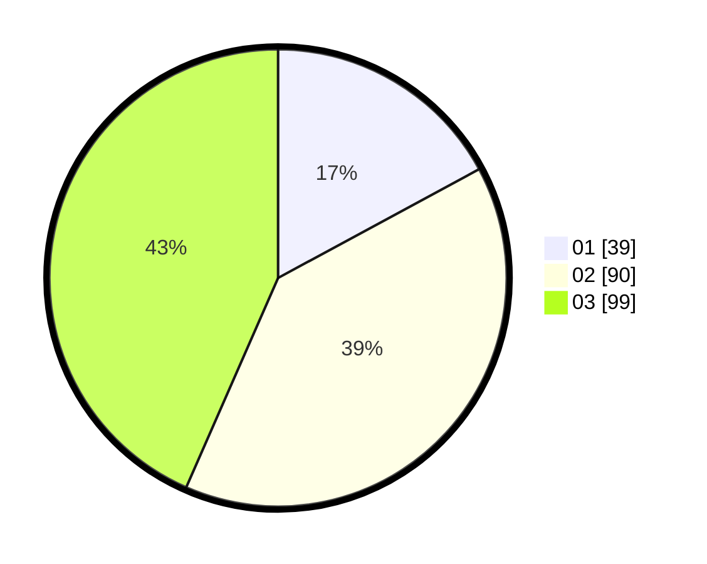

# Hasil

Hasil perolehan suara paslon dapat dilihat pada file paslon-01.txt, paslon-02.txt, dan paslon-03.txt.

Jika tidak ada, artinya data tersebut belum ada pada SIREKAP.

## Perolehan Suara

 * Paslon 01: **39**.
 * Paslon 02: **90**.
 * Paslon 03: **99**.

## Foto C Plano

https://sirekap-obj-formc.kpu.go.id/d185/pemilu/ppwp/31/73/02/10/03/3173021003062-20240216-184956--62108254-4b43-4ad8-85e4-c7b0ab02fa7c.jpg

https://sirekap-obj-formc.kpu.go.id/d185/pemilu/ppwp/31/73/02/10/03/3173021003062-20240216-184957--dfdeeba3-48c4-41ea-91b4-25f7a15b33c8.jpg

https://sirekap-obj-formc.kpu.go.id/d185/pemilu/ppwp/31/73/02/10/03/3173021003062-20240216-184956--3692c943-430d-48a6-8ee3-2006981b4cbd.jpg

## DATA PEMILIH TETAP

Jumlah pemilih dalam DPT: **270**.
 * L: **120**.
 * P: **150**.

## DATA PENGGUNA HAK PILIH

Jumlah pengguna hak pilih dalam DPT: **212**.
 * L: **93**.
 * P: **119**.

Jumlah pengguna hak pilih dalam DPTb: **16**.
 * L: **5**.
 * P: **11**.

Jumlah pengguna hak pilih dalam DPK: **2**.
 * L: **1**.
 * P: **1**.

Jumlah pengguna hak pilih: **230**.
 * L: **99**.
 * P: **131**.

## JUMLAH SUARA SAH DAN TIDAK SAH

JUMLAH SELURUH SUARA SAH: **228**.

JUMLAH SUARA TIDAK SAH: **2**.

JUMLAH SELURUH SUARA SAH DAN SUARA TIDAK SAH: **230**.
