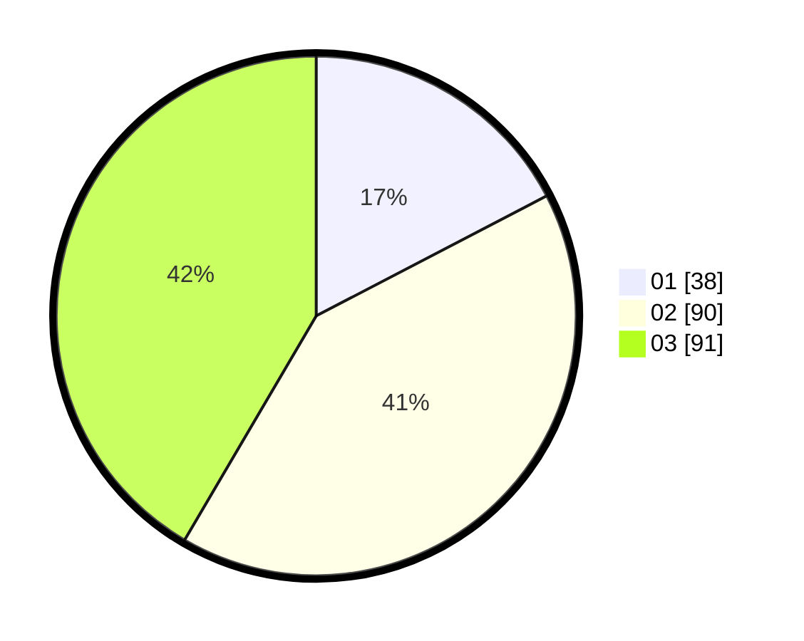

# Hasil

Hasil perolehan suara paslon dapat dilihat pada file paslon-01.txt, paslon-02.txt, dan paslon-03.txt.

Jika tidak ada, artinya data tersebut belum ada pada SIREKAP.

## Perolehan Suara

 * Paslon 01: **38**.
 * Paslon 02: **90**.
 * Paslon 03: **91**.

## Foto C Plano

https://sirekap-obj-formc.kpu.go.id/c299/pemilu/ppwp/31/73/02/10/03/3173021003063-20240216-072224--7b069a8e-908f-4377-8f8a-fbc17d45788b.jpg

https://sirekap-obj-formc.kpu.go.id/c299/pemilu/ppwp/31/73/02/10/03/3173021003063-20240216-072226--7ddf37e0-7153-44b2-bd76-59dd8b459e01.jpg

https://sirekap-obj-formc.kpu.go.id/c299/pemilu/ppwp/31/73/02/10/03/3173021003063-20240216-072225--1a292fb1-e92a-4087-b6db-2b3e9991bc4f.jpg

## DATA PEMILIH TETAP

Jumlah pemilih dalam DPT: **259**.
 * L: **107**.
 * P: **152**.

## DATA PENGGUNA HAK PILIH

Jumlah pengguna hak pilih dalam DPT: **206**.
 * L: **88**.
 * P: **118**.

Jumlah pengguna hak pilih dalam DPTb: **14**.
 * L: **10**.
 * P: **4**.

Jumlah pengguna hak pilih dalam DPK: **1**.
 * L: **0**.
 * P: **1**.

Jumlah pengguna hak pilih: **221**.
 * L: **98**.
 * P: **123**.

## JUMLAH SUARA SAH DAN TIDAK SAH

JUMLAH SELURUH SUARA SAH: **219**.

JUMLAH SUARA TIDAK SAH: **2**.

JUMLAH SELURUH SUARA SAH DAN SUARA TIDAK SAH: **221**.
