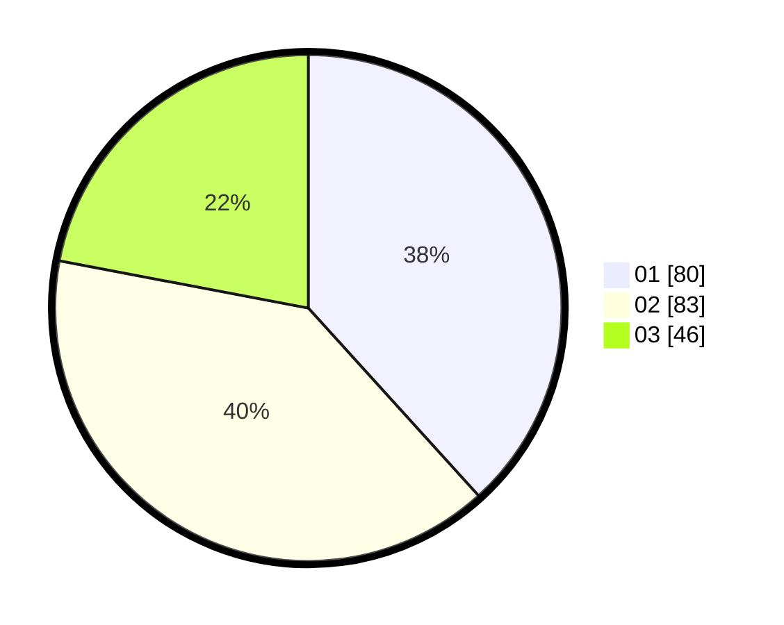

# Hasil

Hasil perolehan suara paslon dapat dilihat pada file paslon-01.txt, paslon-02.txt, dan paslon-03.txt.

Jika tidak ada, artinya data tersebut belum ada pada SIREKAP.

## Perolehan Suara

 * Paslon 01: **80**.
 * Paslon 02: **83**.
 * Paslon 03: **46**.

## Foto C Plano

https://sirekap-obj-formc.kpu.go.id/5330/pemilu/ppwp/31/73/02/10/03/3173021003065-20240216-000344--5ac38169-7a75-4a65-a87c-fb04f8eb02af.jpg

https://sirekap-obj-formc.kpu.go.id/5330/pemilu/ppwp/31/73/02/10/03/3173021003065-20240216-000346--0108ee98-ca28-4f2f-85d9-bca680d1f2e3.jpg

https://sirekap-obj-formc.kpu.go.id/5330/pemilu/ppwp/31/73/02/10/03/3173021003065-20240216-000345--bbe0153a-07a2-4cc4-ab59-c590a2e91f7e.jpg

## DATA PEMILIH TETAP

Jumlah pemilih dalam DPT: **266**.
 * L: **125**.
 * P: **141**.

## DATA PENGGUNA HAK PILIH

Jumlah pengguna hak pilih dalam DPT: **197**.
 * L: **88**.
 * P: **109**.

Jumlah pengguna hak pilih dalam DPTb: **14**.
 * L: **4**.
 * P: **10**.

Jumlah pengguna hak pilih dalam DPK: **2**.
 * L: **1**.
 * P: **1**.

Jumlah pengguna hak pilih: **213**.
 * L: **93**.
 * P: **120**.

## JUMLAH SUARA SAH DAN TIDAK SAH

JUMLAH SELURUH SUARA SAH: **209**.

JUMLAH SUARA TIDAK SAH: **4**.

JUMLAH SELURUH SUARA SAH DAN SUARA TIDAK SAH: **213**.
