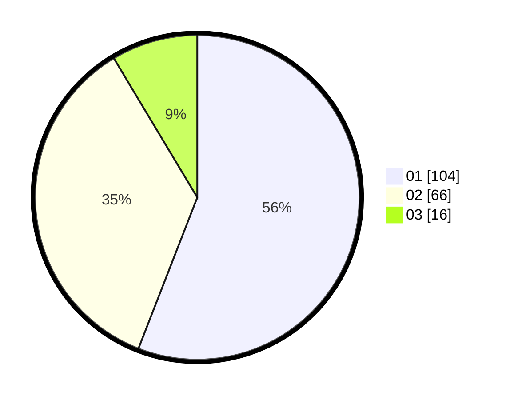

# Hasil

Hasil perolehan suara paslon dapat dilihat pada file paslon-01.txt, paslon-02.txt, dan paslon-03.txt.

Jika tidak ada, artinya data tersebut belum ada pada SIREKAP.

## Perolehan Suara

 * Paslon 01: **104**.
 * Paslon 02: **66**.
 * Paslon 03: **16**.

## Foto C Plano

https://sirekap-obj-formc.kpu.go.id/450d/pemilu/ppwp/31/73/02/10/03/3173021003067-20240216-131912--c3243018-60cb-4a8e-af43-5d44eb4dc83c.jpg

https://sirekap-obj-formc.kpu.go.id/450d/pemilu/ppwp/31/73/02/10/03/3173021003067-20240216-131913--fcb6d3b7-953e-4b40-955b-541ac23a72fd.jpg

https://sirekap-obj-formc.kpu.go.id/450d/pemilu/ppwp/31/73/02/10/03/3173021003067-20240216-131913--099b5377-bd69-4704-84e5-cb43c2edb922.jpg

## DATA PEMILIH TETAP

Jumlah pemilih dalam DPT: **257**.
 * L: **128**.
 * P: **129**.

## DATA PENGGUNA HAK PILIH

Jumlah pengguna hak pilih dalam DPT: **183**.
 * L: **84**.
 * P: **99**.

Jumlah pengguna hak pilih dalam DPTb: **13**.
 * L: **1**.
 * P: **12**.

Jumlah pengguna hak pilih dalam DPK: **0**.
 * L: **0**.
 * P: **0**.

Jumlah pengguna hak pilih: **196**.
 * L: **85**.
 * P: **111**.

## JUMLAH SUARA SAH DAN TIDAK SAH

JUMLAH SELURUH SUARA SAH: **186**.

JUMLAH SUARA TIDAK SAH: **10**.

JUMLAH SELURUH SUARA SAH DAN SUARA TIDAK SAH: **196**.
