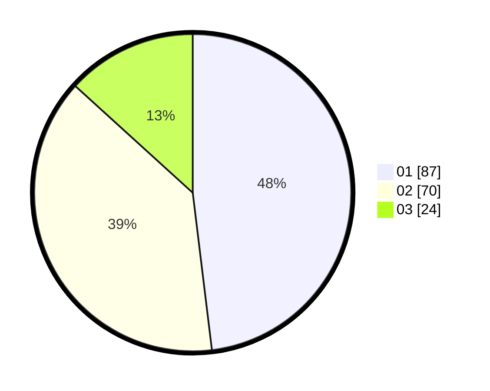

# Hasil

Hasil perolehan suara paslon dapat dilihat pada file paslon-01.txt, paslon-02.txt, dan paslon-03.txt.

Jika tidak ada, artinya data tersebut belum ada pada SIREKAP.

## Perolehan Suara

 * Paslon 01: **87**.
 * Paslon 02: **70**.
 * Paslon 03: **24**.

## Foto C Plano

https://sirekap-obj-formc.kpu.go.id/949d/pemilu/ppwp/31/73/02/10/03/3173021003069-20240216-044354--c044ebe6-614b-467b-930d-ab008c43002c.jpg

https://sirekap-obj-formc.kpu.go.id/949d/pemilu/ppwp/31/73/02/10/03/3173021003069-20240216-044355--df908933-9072-44c6-af8f-e4529f70eba8.jpg

https://sirekap-obj-formc.kpu.go.id/949d/pemilu/ppwp/31/73/02/10/03/3173021003069-20240216-044354--c97e4346-14e2-412b-8457-d32c310a6e6c.jpg

## DATA PEMILIH TETAP

Jumlah pemilih dalam DPT: **238**.
 * L: **121**.
 * P: **117**.

## DATA PENGGUNA HAK PILIH

Jumlah pengguna hak pilih dalam DPT: **180**.
 * L: **93**.
 * P: **87**.

Jumlah pengguna hak pilih dalam DPTb: **0**.
 * L: **0**.
 * P: **0**.

Jumlah pengguna hak pilih dalam DPK: **2**.
 * L: **1**.
 * P: **1**.

Jumlah pengguna hak pilih: **182**.
 * L: **94**.
 * P: **88**.

## JUMLAH SUARA SAH DAN TIDAK SAH

JUMLAH SELURUH SUARA SAH: **181**.

JUMLAH SUARA TIDAK SAH: **1**.

JUMLAH SELURUH SUARA SAH DAN SUARA TIDAK SAH: **182**.
