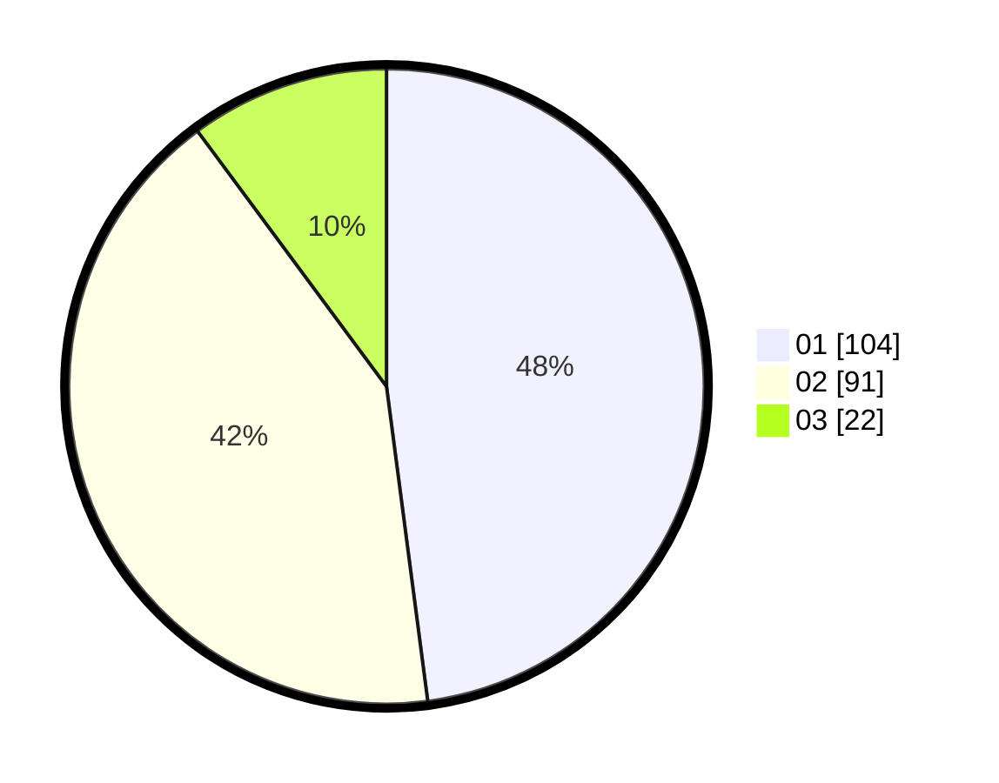

# Hasil

Hasil perolehan suara paslon dapat dilihat pada file paslon-01.txt, paslon-02.txt, dan paslon-03.txt.

Jika tidak ada, artinya data tersebut belum ada pada SIREKAP.

## Perolehan Suara

 * Paslon 01: **104**.
 * Paslon 02: **91**.
 * Paslon 03: **22**.

## Foto C Plano

https://sirekap-obj-formc.kpu.go.id/5106/pemilu/ppwp/31/73/02/10/03/3173021003071-20240216-143443--c18b3337-4cfd-4965-b16d-9d6bad783170.jpg

https://sirekap-obj-formc.kpu.go.id/5106/pemilu/ppwp/31/73/02/10/03/3173021003071-20240216-143445--e3cf6803-a9b2-4c0f-9bef-032695c929c7.jpg

https://sirekap-obj-formc.kpu.go.id/5106/pemilu/ppwp/31/73/02/10/03/3173021003071-20240216-143444--a8fedfb1-04b2-4063-88b8-b9570febbb77.jpg

## DATA PEMILIH TETAP

Jumlah pemilih dalam DPT: **261**.
 * L: **137**.
 * P: **124**.

## DATA PENGGUNA HAK PILIH

Jumlah pengguna hak pilih dalam DPT: **261**.
 * L: **137**.
 * P: **124**.

Jumlah pengguna hak pilih dalam DPTb: **1**.
 * L: **0**.
 * P: **1**.

Jumlah pengguna hak pilih dalam DPK: **1**.
 * L: **0**.
 * P: **1**.

Jumlah pengguna hak pilih: **263**.
 * L: **137**.
 * P: **126**.

## JUMLAH SUARA SAH DAN TIDAK SAH

JUMLAH SELURUH SUARA SAH: **217**.

JUMLAH SUARA TIDAK SAH: **1**.

JUMLAH SELURUH SUARA SAH DAN SUARA TIDAK SAH: **218**.
