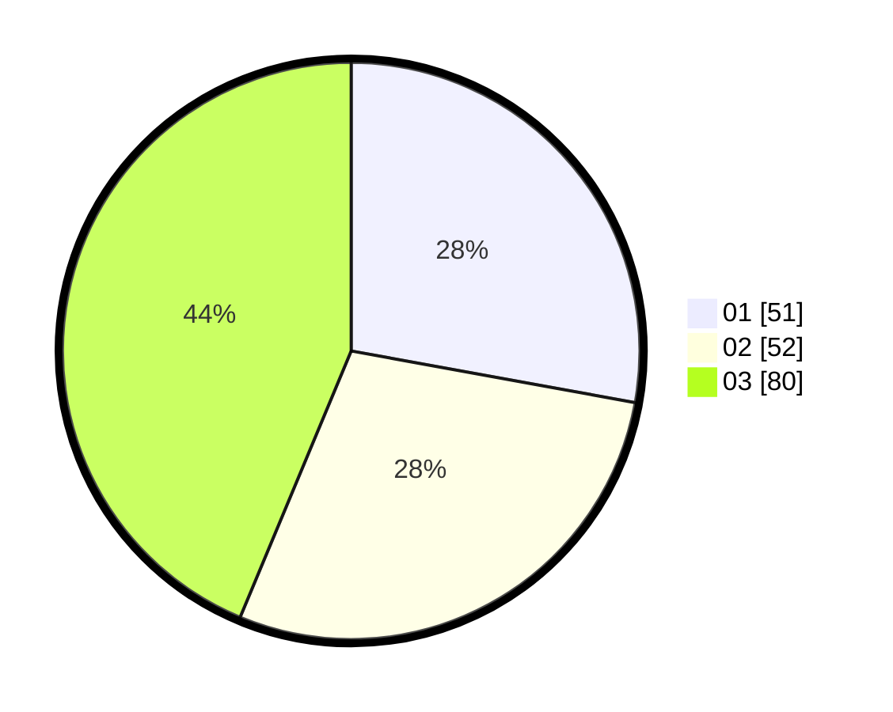

# Hasil

Hasil perolehan suara paslon dapat dilihat pada file paslon-01.txt, paslon-02.txt, dan paslon-03.txt.

Jika tidak ada, artinya data tersebut belum ada pada SIREKAP.

## Perolehan Suara

 * Paslon 01: **51**.
 * Paslon 02: **52**.
 * Paslon 03: **80**.

## Foto C Plano

https://sirekap-obj-formc.kpu.go.id/5cc3/pemilu/ppwp/31/73/02/10/03/3173021003079-20240216-150021--6522ef73-8d57-4dcf-9355-98577d85a53c.jpg

https://sirekap-obj-formc.kpu.go.id/5cc3/pemilu/ppwp/31/73/02/10/03/3173021003079-20240216-150022--c6b0b777-c449-499f-81b1-2807c216b2ad.jpg

https://sirekap-obj-formc.kpu.go.id/5cc3/pemilu/ppwp/31/73/02/10/03/3173021003079-20240216-150022--d9493504-30ea-40a5-a754-f318021ea585.jpg

## DATA PEMILIH TETAP

Jumlah pemilih dalam DPT: **230**.
 * L: **117**.
 * P: **113**.

## DATA PENGGUNA HAK PILIH

Jumlah pengguna hak pilih dalam DPT: **173**.
 * L: **85**.
 * P: **88**.

Jumlah pengguna hak pilih dalam DPTb: **10**.
 * L: **2**.
 * P: **8**.

Jumlah pengguna hak pilih dalam DPK: **2**.
 * L: **1**.
 * P: **1**.

Jumlah pengguna hak pilih: **185**.
 * L: **88**.
 * P: **97**.

## JUMLAH SUARA SAH DAN TIDAK SAH

JUMLAH SELURUH SUARA SAH: **183**.

JUMLAH SUARA TIDAK SAH: **2**.

JUMLAH SELURUH SUARA SAH DAN SUARA TIDAK SAH: **185**.
