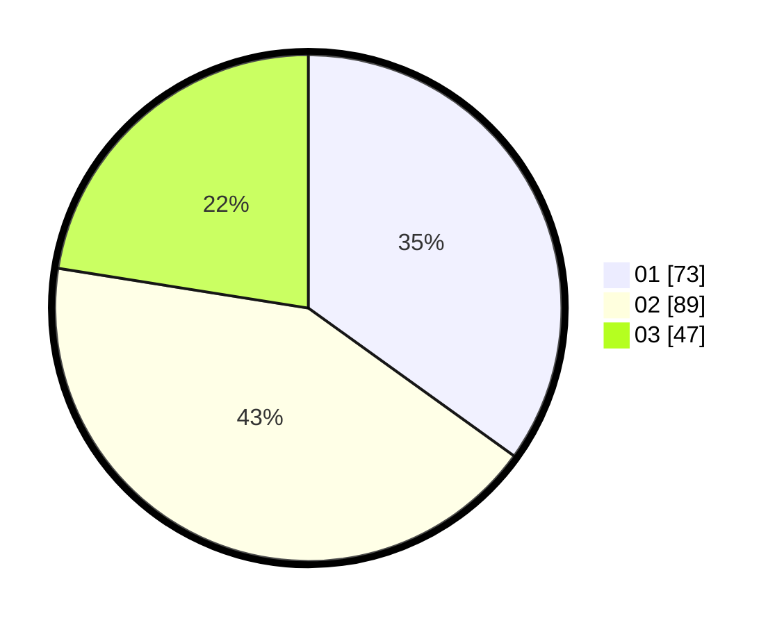

# Hasil

Hasil perolehan suara paslon dapat dilihat pada file paslon-01.txt, paslon-02.txt, dan paslon-03.txt.

Jika tidak ada, artinya data tersebut belum ada pada SIREKAP.

## Perolehan Suara

 * Paslon 01: **73**.
 * Paslon 02: **89**.
 * Paslon 03: **47**.

## Foto C Plano

https://sirekap-obj-formc.kpu.go.id/bbb9/pemilu/ppwp/31/73/02/10/03/3173021003081-20240216-133806--293d75c5-0671-451d-ab9b-b305eb88f6d2.jpg

https://sirekap-obj-formc.kpu.go.id/bbb9/pemilu/ppwp/31/73/02/10/03/3173021003081-20240216-133807--c798e223-fc5b-4800-aedc-ac8202467635.jpg

https://sirekap-obj-formc.kpu.go.id/bbb9/pemilu/ppwp/31/73/02/10/03/3173021003081-20240216-133806--7bd819f9-f149-4c48-ae75-f9dd52476def.jpg

## DATA PEMILIH TETAP

Jumlah pemilih dalam DPT: **260**.
 * L: **123**.
 * P: **137**.

## DATA PENGGUNA HAK PILIH

Jumlah pengguna hak pilih dalam DPT: **207**.
 * L: **96**.
 * P: **111**.

Jumlah pengguna hak pilih dalam DPTb: **2**.
 * L: **2**.
 * P: **0**.

Jumlah pengguna hak pilih dalam DPK: **4**.
 * L: **1**.
 * P: **3**.

Jumlah pengguna hak pilih: **213**.
 * L: **99**.
 * P: **114**.

## JUMLAH SUARA SAH DAN TIDAK SAH

JUMLAH SELURUH SUARA SAH: **209**.

JUMLAH SUARA TIDAK SAH: **4**.

JUMLAH SELURUH SUARA SAH DAN SUARA TIDAK SAH: **213**.
