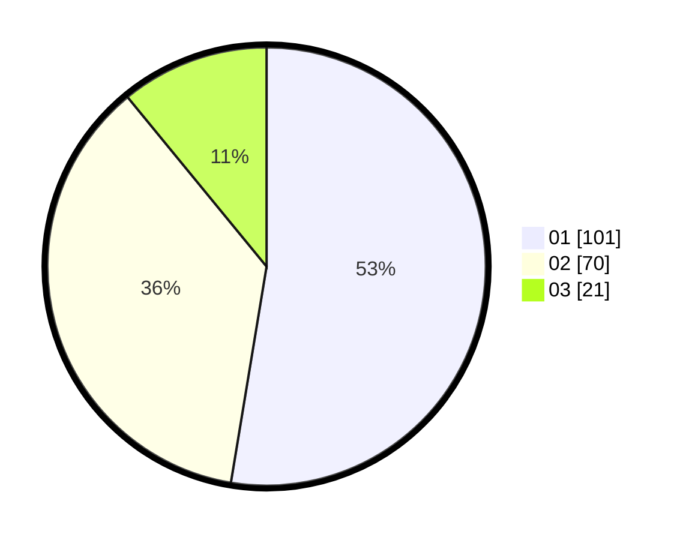

# Hasil

Hasil perolehan suara paslon dapat dilihat pada file paslon-01.txt, paslon-02.txt, dan paslon-03.txt.

Jika tidak ada, artinya data tersebut belum ada pada SIREKAP.

## Perolehan Suara

 * Paslon 01: **101**.
 * Paslon 02: **70**.
 * Paslon 03: **21**.

## Foto C Plano

https://sirekap-obj-formc.kpu.go.id/d830/pemilu/ppwp/31/73/02/10/03/3173021003086-20240216-030424--61c215c9-ec36-4f0e-95e4-dd709b26cdad.jpg

https://sirekap-obj-formc.kpu.go.id/d830/pemilu/ppwp/31/73/02/10/03/3173021003086-20240216-030440--906bbfd9-7ed0-4624-a56e-f3c6fbb7eb89.jpg

https://sirekap-obj-formc.kpu.go.id/d830/pemilu/ppwp/31/73/02/10/03/3173021003086-20240216-030429--144cc232-e072-43f6-b343-baba5afb7113.jpg

## DATA PEMILIH TETAP

Jumlah pemilih dalam DPT: **245**.
 * L: **132**.
 * P: **113**.

## DATA PENGGUNA HAK PILIH

Jumlah pengguna hak pilih dalam DPT: **191**.
 * L: **103**.
 * P: **88**.

Jumlah pengguna hak pilih dalam DPTb: **1**.
 * L: **1**.
 * P: **0**.

Jumlah pengguna hak pilih dalam DPK: **1**.
 * L: **0**.
 * P: **1**.

Jumlah pengguna hak pilih: **193**.
 * L: **104**.
 * P: **89**.

## JUMLAH SUARA SAH DAN TIDAK SAH

JUMLAH SELURUH SUARA SAH: **192**.

JUMLAH SUARA TIDAK SAH: **1**.

JUMLAH SELURUH SUARA SAH DAN SUARA TIDAK SAH: **193**.
