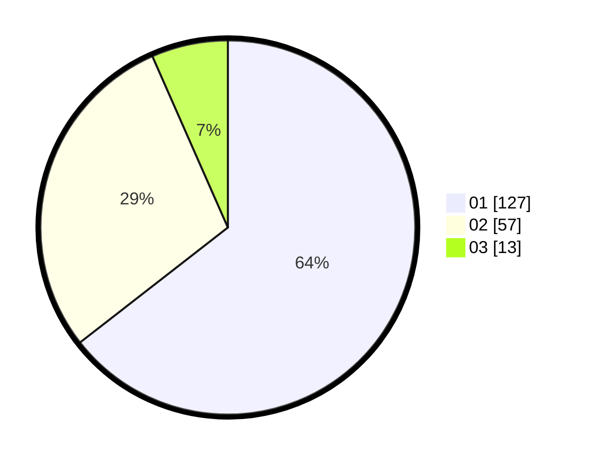

# Hasil

Hasil perolehan suara paslon dapat dilihat pada file paslon-01.txt, paslon-02.txt, dan paslon-03.txt.

Jika tidak ada, artinya data tersebut belum ada pada SIREKAP.

## Perolehan Suara

 * Paslon 01: **127**.
 * Paslon 02: **57**.
 * Paslon 03: **13**.

## Foto C Plano

https://sirekap-obj-formc.kpu.go.id/fed3/pemilu/ppwp/31/73/02/10/03/3173021003087-20240216-142441--77f10149-b378-49c0-9c42-59beff0833c8.jpg

https://sirekap-obj-formc.kpu.go.id/fed3/pemilu/ppwp/31/73/02/10/03/3173021003087-20240216-142442--c5203f97-df96-4435-ad5d-0d5571fd024c.jpg

https://sirekap-obj-formc.kpu.go.id/fed3/pemilu/ppwp/31/73/02/10/03/3173021003087-20240216-142442--38789f84-0a34-4cf5-99f8-447263228906.jpg

## DATA PEMILIH TETAP

Jumlah pemilih dalam DPT: **252**.
 * L: **138**.
 * P: **114**.

## DATA PENGGUNA HAK PILIH

Jumlah pengguna hak pilih dalam DPT: **203**.
 * L: **109**.
 * P: **94**.

Jumlah pengguna hak pilih dalam DPTb: **3**.
 * L: **2**.
 * P: **1**.

Jumlah pengguna hak pilih dalam DPK: **0**.
 * L: **0**.
 * P: **0**.

Jumlah pengguna hak pilih: **206**.
 * L: **111**.
 * P: **95**.

## JUMLAH SUARA SAH DAN TIDAK SAH

JUMLAH SELURUH SUARA SAH: **197**.

JUMLAH SUARA TIDAK SAH: **9**.

JUMLAH SELURUH SUARA SAH DAN SUARA TIDAK SAH: **206**.
