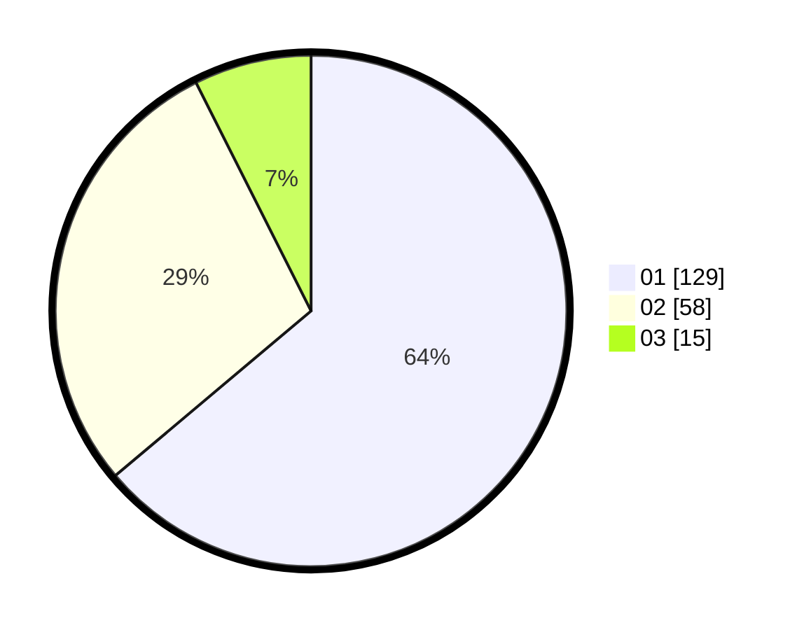

# Hasil

Hasil perolehan suara paslon dapat dilihat pada file paslon-01.txt, paslon-02.txt, dan paslon-03.txt.

Jika tidak ada, artinya data tersebut belum ada pada SIREKAP.

## Perolehan Suara

 * Paslon 01: **129**.
 * Paslon 02: **58**.
 * Paslon 03: **15**.

## Foto C Plano

https://sirekap-obj-formc.kpu.go.id/8090/pemilu/ppwp/31/73/02/10/03/3173021003088-20240216-132318--1c65ed78-e50d-4512-a70d-58efd68e229d.jpg

https://sirekap-obj-formc.kpu.go.id/8090/pemilu/ppwp/31/73/02/10/03/3173021003088-20240216-132319--0c7c6444-d96d-4ba6-a6f7-5e6751a73ecb.jpg

https://sirekap-obj-formc.kpu.go.id/8090/pemilu/ppwp/31/73/02/10/03/3173021003088-20240216-132318--1d13af21-3a29-4edf-befb-ba8ffbc38729.jpg

## DATA PEMILIH TETAP

Jumlah pemilih dalam DPT: **253**.
 * L: **123**.
 * P: **130**.

## DATA PENGGUNA HAK PILIH

Jumlah pengguna hak pilih dalam DPT: **203**.
 * L: **99**.
 * P: **104**.

Jumlah pengguna hak pilih dalam DPTb: **2**.
 * L: **2**.
 * P: **0**.

Jumlah pengguna hak pilih dalam DPK: **0**.
 * L: **0**.
 * P: **0**.

Jumlah pengguna hak pilih: **205**.
 * L: **101**.
 * P: **104**.

## JUMLAH SUARA SAH DAN TIDAK SAH

JUMLAH SELURUH SUARA SAH: **202**.

JUMLAH SUARA TIDAK SAH: **3**.

JUMLAH SELURUH SUARA SAH DAN SUARA TIDAK SAH: **205**.
