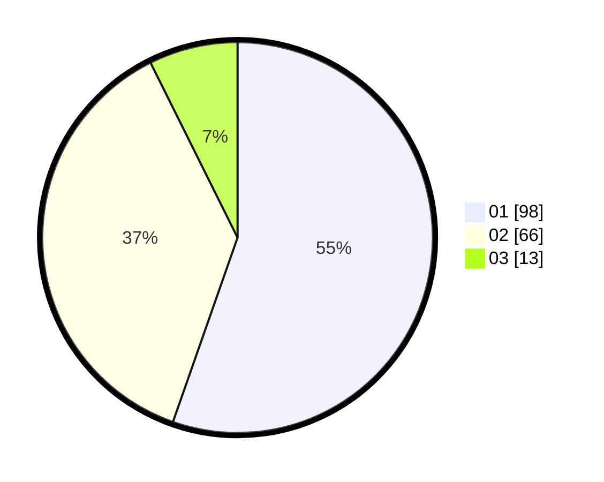

# Hasil

Hasil perolehan suara paslon dapat dilihat pada file paslon-01.txt, paslon-02.txt, dan paslon-03.txt.

Jika tidak ada, artinya data tersebut belum ada pada SIREKAP.

## Perolehan Suara

 * Paslon 01: **98**.
 * Paslon 02: **66**.
 * Paslon 03: **13**.

## Foto C Plano

https://sirekap-obj-formc.kpu.go.id/321b/pemilu/ppwp/31/73/02/10/03/3173021003089-20240216-053829--0bb69981-a1eb-40e5-a4d8-0b58b05808cf.jpg

https://sirekap-obj-formc.kpu.go.id/321b/pemilu/ppwp/31/73/02/10/03/3173021003089-20240216-053830--530492a0-2341-4f7f-a58f-960198701080.jpg

https://sirekap-obj-formc.kpu.go.id/321b/pemilu/ppwp/31/73/02/10/03/3173021003089-20240216-053829--5edac0a7-c9da-4221-9263-5d2727211eb8.jpg

## DATA PEMILIH TETAP

Jumlah pemilih dalam DPT: **214**.
 * L: **112**.
 * P: **102**.

## DATA PENGGUNA HAK PILIH

Jumlah pengguna hak pilih dalam DPT: **178**.
 * L: **91**.
 * P: **87**.

Jumlah pengguna hak pilih dalam DPTb: **0**.
 * L: **0**.
 * P: **0**.

Jumlah pengguna hak pilih dalam DPK: **0**.
 * L: **0**.
 * P: **0**.

Jumlah pengguna hak pilih: **178**.
 * L: **91**.
 * P: **87**.

## JUMLAH SUARA SAH DAN TIDAK SAH

JUMLAH SELURUH SUARA SAH: **177**.

JUMLAH SUARA TIDAK SAH: **1**.

JUMLAH SELURUH SUARA SAH DAN SUARA TIDAK SAH: **178**.
