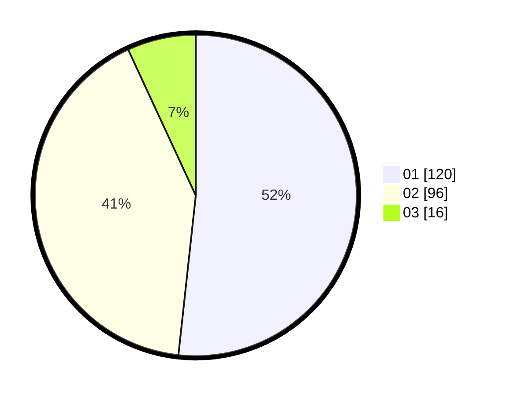

# Hasil

Hasil perolehan suara paslon dapat dilihat pada file paslon-01.txt, paslon-02.txt, dan paslon-03.txt.

Jika tidak ada, artinya data tersebut belum ada pada SIREKAP.

## Perolehan Suara

 * Paslon 01: **120**.
 * Paslon 02: **96**.
 * Paslon 03: **16**.

## Foto C Plano

https://sirekap-obj-formc.kpu.go.id/494a/pemilu/ppwp/31/73/02/10/03/3173021003092-20240216-104700--a6fa1edc-374b-4c15-a4e5-69232e81a17a.jpg

https://sirekap-obj-formc.kpu.go.id/494a/pemilu/ppwp/31/73/02/10/03/3173021003092-20240216-104701--7ec18378-70f4-49de-a6c2-35b3bfffda83.jpg

https://sirekap-obj-formc.kpu.go.id/494a/pemilu/ppwp/31/73/02/10/03/3173021003092-20240216-104701--64747059-9a8b-40b9-8926-31c81dd5868e.jpg

## DATA PEMILIH TETAP

Jumlah pemilih dalam DPT: **257**.
 * L: **130**.
 * P: **127**.

## DATA PENGGUNA HAK PILIH

Jumlah pengguna hak pilih dalam DPT: **228**.
 * L: **112**.
 * P: **116**.

Jumlah pengguna hak pilih dalam DPTb: **8**.
 * L: **4**.
 * P: **4**.

Jumlah pengguna hak pilih dalam DPK: **3**.
 * L: **1**.
 * P: **2**.

Jumlah pengguna hak pilih: **239**.
 * L: **117**.
 * P: **122**.

## JUMLAH SUARA SAH DAN TIDAK SAH

JUMLAH SELURUH SUARA SAH: **232**.

JUMLAH SUARA TIDAK SAH: **7**.

JUMLAH SELURUH SUARA SAH DAN SUARA TIDAK SAH: **239**.
