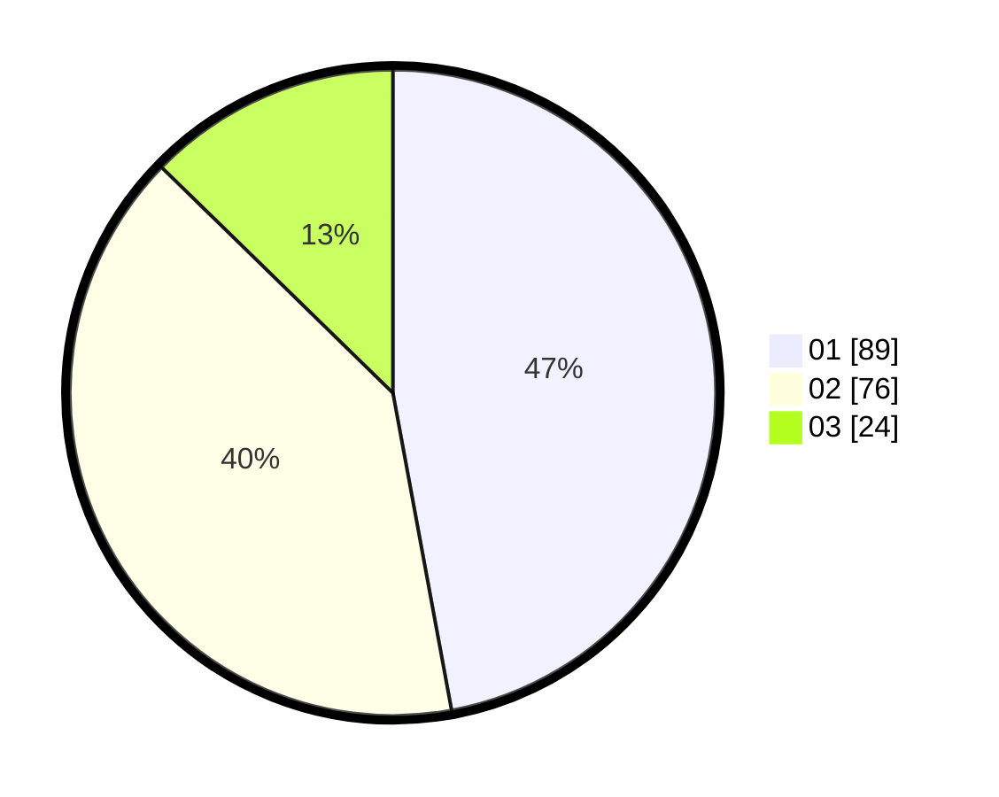

# Hasil

Hasil perolehan suara paslon dapat dilihat pada file paslon-01.txt, paslon-02.txt, dan paslon-03.txt.

Jika tidak ada, artinya data tersebut belum ada pada SIREKAP.

## Perolehan Suara

 * Paslon 01: **89**.
 * Paslon 02: **76**.
 * Paslon 03: **24**.

## Foto C Plano

https://sirekap-obj-formc.kpu.go.id/debf/pemilu/ppwp/31/73/02/10/03/3173021003093-20240215-005424--c81831c6-2ea3-4228-9ed0-8b58b5e5915d.jpg

https://sirekap-obj-formc.kpu.go.id/debf/pemilu/ppwp/31/73/02/10/03/3173021003093-20240215-005610--86c3b3d8-fd0c-4b83-a88e-2e5a8e29a502.jpg

https://sirekap-obj-formc.kpu.go.id/debf/pemilu/ppwp/31/73/02/10/03/3173021003093-20240215-005822--f1aaaf91-6dd9-4b08-8627-30bc20655d06.jpg

## DATA PEMILIH TETAP

Jumlah pemilih dalam DPT: **213**.
 * L: **109**.
 * P: **104**.

## DATA PENGGUNA HAK PILIH

Jumlah pengguna hak pilih dalam DPT: **181**.
 * L: **91**.
 * P: **90**.

Jumlah pengguna hak pilih dalam DPTb: **8**.
 * L: **7**.
 * P: **1**.

Jumlah pengguna hak pilih dalam DPK: **3**.
 * L: **2**.
 * P: **1**.

Jumlah pengguna hak pilih: **192**.
 * L: **100**.
 * P: **92**.

## JUMLAH SUARA SAH DAN TIDAK SAH

JUMLAH SELURUH SUARA SAH: **192**.

JUMLAH SUARA TIDAK SAH: **3**.

JUMLAH SELURUH SUARA SAH DAN SUARA TIDAK SAH: **195**.
