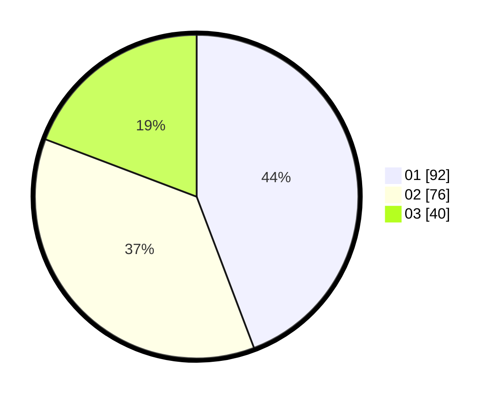

# Hasil

Hasil perolehan suara paslon dapat dilihat pada file paslon-01.txt, paslon-02.txt, dan paslon-03.txt.

Jika tidak ada, artinya data tersebut belum ada pada SIREKAP.

## Perolehan Suara

 * Paslon 01: **92**.
 * Paslon 02: **76**.
 * Paslon 03: **40**.

## Foto C Plano

https://sirekap-obj-formc.kpu.go.id/e8ed/pemilu/ppwp/31/73/02/10/03/3173021003099-20240216-104905--3405e30d-bd36-4bb1-ba70-ef4c7f04505d.jpg

https://sirekap-obj-formc.kpu.go.id/e8ed/pemilu/ppwp/31/73/02/10/03/3173021003099-20240216-104906--2dadf880-6bd8-46f5-b140-c92d857768e9.jpg

https://sirekap-obj-formc.kpu.go.id/e8ed/pemilu/ppwp/31/73/02/10/03/3173021003099-20240216-104905--489b13da-1f9a-4400-ac65-66bc35b0609c.jpg

## DATA PEMILIH TETAP

Jumlah pemilih dalam DPT: **277**.
 * L: **147**.
 * P: **130**.

## DATA PENGGUNA HAK PILIH

Jumlah pengguna hak pilih dalam DPT: **198**.
 * L: **109**.
 * P: **89**.

Jumlah pengguna hak pilih dalam DPTb: **10**.
 * L: **3**.
 * P: **7**.

Jumlah pengguna hak pilih dalam DPK: **1**.
 * L: **1**.
 * P: **0**.

Jumlah pengguna hak pilih: **209**.
 * L: **113**.
 * P: **96**.

## JUMLAH SUARA SAH DAN TIDAK SAH

JUMLAH SELURUH SUARA SAH: **208**.

JUMLAH SUARA TIDAK SAH: **0**.

JUMLAH SELURUH SUARA SAH DAN SUARA TIDAK SAH: **208**.
