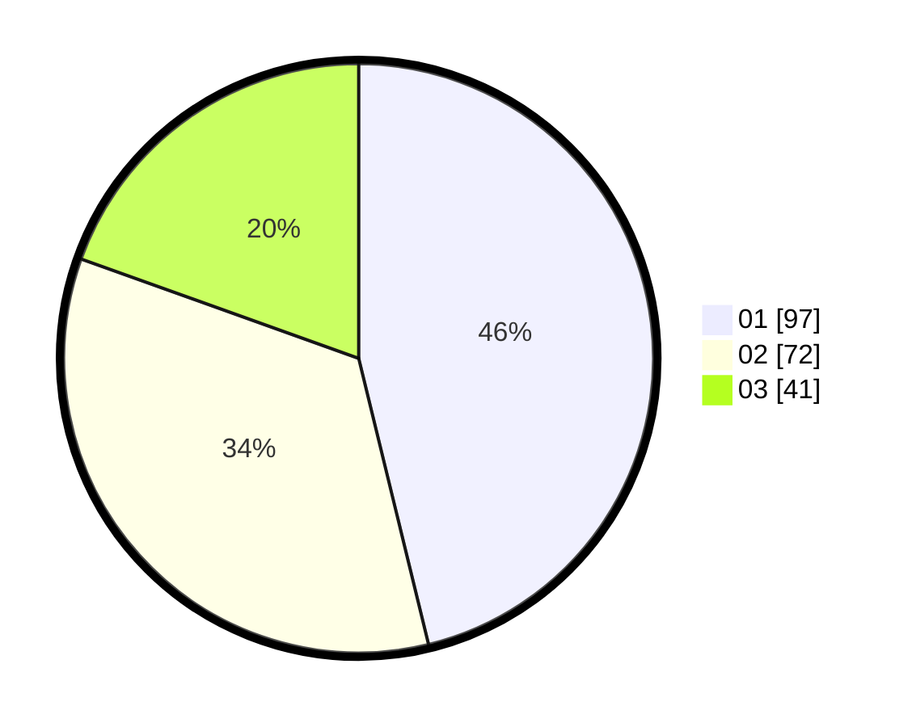

# Hasil

Hasil perolehan suara paslon dapat dilihat pada file paslon-01.txt, paslon-02.txt, dan paslon-03.txt.

Jika tidak ada, artinya data tersebut belum ada pada SIREKAP.

## Perolehan Suara

 * Paslon 01: **97**.
 * Paslon 02: **72**.
 * Paslon 03: **41**.

## Foto C Plano

https://sirekap-obj-formc.kpu.go.id/215a/pemilu/ppwp/31/73/02/10/03/3173021003102-20240214-220631--845cc625-a53d-4e7a-b68f-bdeeb954780c.jpg

https://sirekap-obj-formc.kpu.go.id/215a/pemilu/ppwp/31/73/02/10/03/3173021003102-20240214-221422--d8947c8e-fd9e-499e-a367-949641cc113a.jpg

https://sirekap-obj-formc.kpu.go.id/215a/pemilu/ppwp/31/73/02/10/03/3173021003102-20240214-220706--979b0a77-5be2-4934-bf5c-b62de4d2c5ff.jpg
