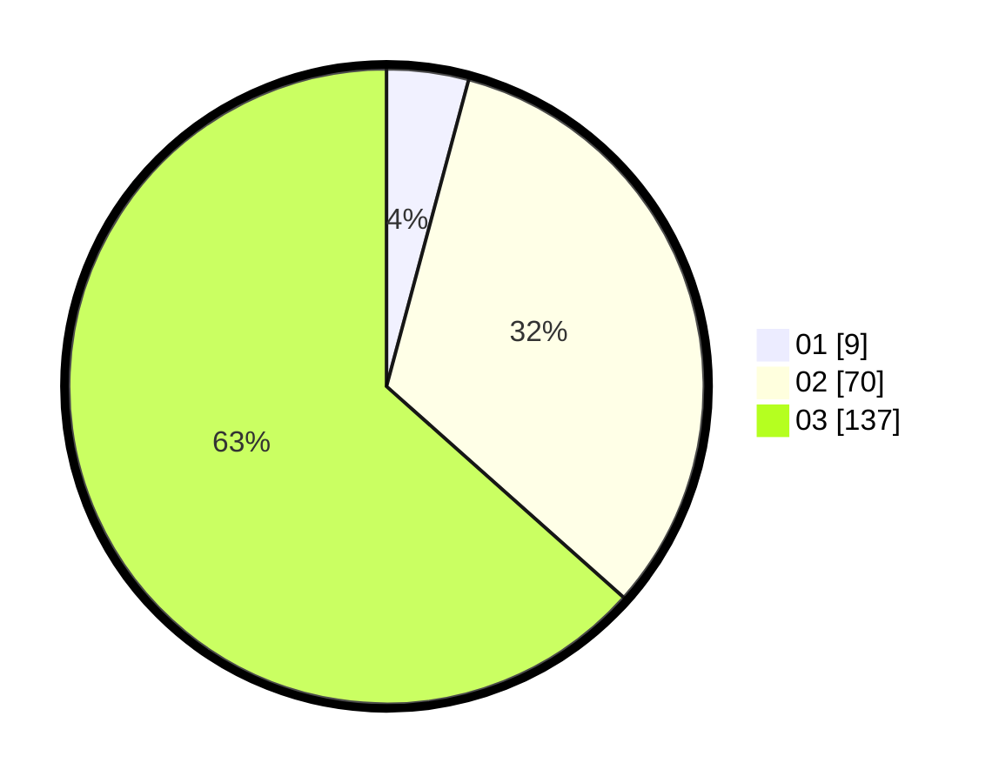

# Hasil

Hasil perolehan suara paslon dapat dilihat pada file paslon-01.txt, paslon-02.txt, dan paslon-03.txt.

Jika tidak ada, artinya data tersebut belum ada pada SIREKAP.

## Perolehan Suara

 * Paslon 01: **9**.
 * Paslon 02: **70**.
 * Paslon 03: **137**.

## Foto C Plano

https://sirekap-obj-formc.kpu.go.id/d47c/pemilu/ppwp/31/73/02/10/04/3173021004008-20240214-204404--b809294f-749c-4ec6-ab44-4e7b91199798.jpg

https://sirekap-obj-formc.kpu.go.id/d47c/pemilu/ppwp/31/73/02/10/04/3173021004008-20240214-195908--90262fac-0dc9-451d-876b-96cf1aea478c.jpg

https://sirekap-obj-formc.kpu.go.id/d47c/pemilu/ppwp/31/73/02/10/04/3173021004008-20240214-224719--b1a80812-aacc-4b20-a11a-0f5d4dd6a953.jpg
