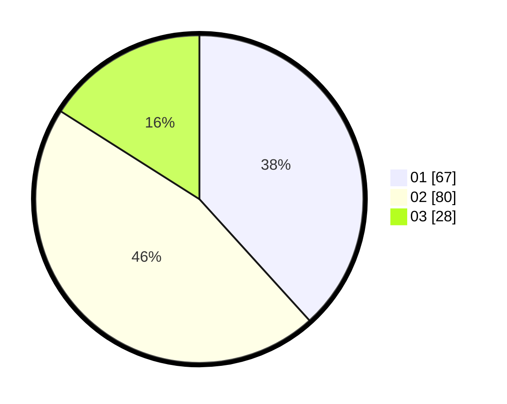

# Hasil

Hasil perolehan suara paslon dapat dilihat pada file paslon-01.txt, paslon-02.txt, dan paslon-03.txt.

Jika tidak ada, artinya data tersebut belum ada pada SIREKAP.

## Perolehan Suara

 * Paslon 01: **67**.
 * Paslon 02: **80**.
 * Paslon 03: **28**.

## Foto C Plano

https://sirekap-obj-formc.kpu.go.id/5348/pemilu/ppwp/31/73/02/10/04/3173021004015-20240214-195931--62cf8a1e-51b3-4722-90fb-ae8677572d6f.jpg

https://sirekap-obj-formc.kpu.go.id/5348/pemilu/ppwp/31/73/02/10/04/3173021004015-20240214-200329--67e70871-9dd3-44fe-94c1-1709830e072d.jpg

https://sirekap-obj-formc.kpu.go.id/5348/pemilu/ppwp/31/73/02/10/04/3173021004015-20240214-200443--8105bd3f-0545-47c9-a5b7-396fc9c03172.jpg

## DATA PEMILIH TETAP

Jumlah pemilih dalam DPT: **236**.
 * L: **126**.
 * P: **110**.

## DATA PENGGUNA HAK PILIH

Jumlah pengguna hak pilih dalam DPT: **174**.
 * L: **94**.
 * P: **80**.

Jumlah pengguna hak pilih dalam DPTb: **3**.
 * L: **1**.
 * P: **2**.

Jumlah pengguna hak pilih dalam DPK: **0**.
 * L: **0**.
 * P: **0**.

Jumlah pengguna hak pilih: **177**.
 * L: **95**.
 * P: **82**.

## JUMLAH SUARA SAH DAN TIDAK SAH

JUMLAH SELURUH SUARA SAH: **175**.

JUMLAH SUARA TIDAK SAH: **2**.

JUMLAH SELURUH SUARA SAH DAN SUARA TIDAK SAH: **177**.
