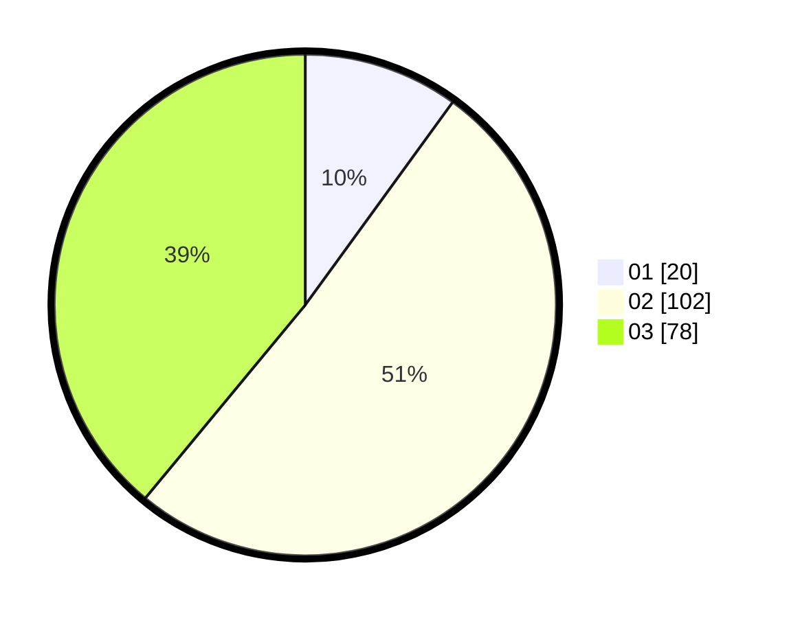

# Hasil

Hasil perolehan suara paslon dapat dilihat pada file paslon-01.txt, paslon-02.txt, dan paslon-03.txt.

Jika tidak ada, artinya data tersebut belum ada pada SIREKAP.

## Perolehan Suara

 * Paslon 01: **20**.
 * Paslon 02: **102**.
 * Paslon 03: **78**.

## Foto C Plano

https://sirekap-obj-formc.kpu.go.id/7f14/pemilu/ppwp/31/73/02/10/04/3173021004020-20240215-012017--3919392b-a51a-4e87-a4f1-9e9e3a644488.jpg

https://sirekap-obj-formc.kpu.go.id/7f14/pemilu/ppwp/31/73/02/10/04/3173021004020-20240215-012050--4d1ff769-3038-4d3c-ad42-8722d3bfba13.jpg

https://sirekap-obj-formc.kpu.go.id/7f14/pemilu/ppwp/31/73/02/10/04/3173021004020-20240215-012108--0da2cf44-9b91-44b3-95ca-4ab56ed67d59.jpg
