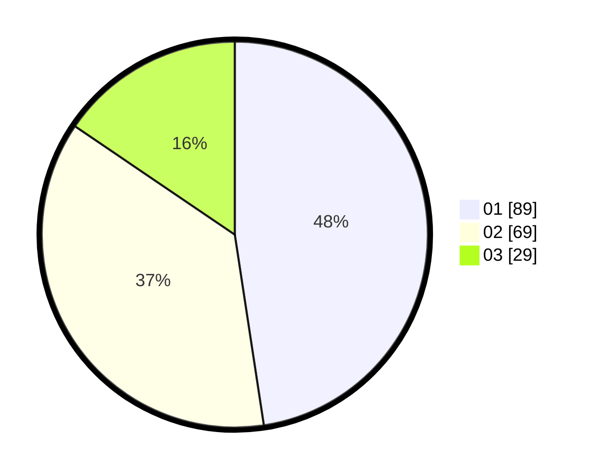

# Hasil

Hasil perolehan suara paslon dapat dilihat pada file paslon-01.txt, paslon-02.txt, dan paslon-03.txt.

Jika tidak ada, artinya data tersebut belum ada pada SIREKAP.

## Perolehan Suara

 * Paslon 01: **89**.
 * Paslon 02: **69**.
 * Paslon 03: **29**.

## Foto C Plano

https://sirekap-obj-formc.kpu.go.id/b193/pemilu/ppwp/31/73/02/10/04/3173021004027-20240214-233806--397c760e-5359-44f9-8e59-02a241e60534.jpg

https://sirekap-obj-formc.kpu.go.id/b193/pemilu/ppwp/31/73/02/10/04/3173021004027-20240215-001519--8938364c-0b3a-4f2e-9f6d-29087491ac3e.jpg

https://sirekap-obj-formc.kpu.go.id/b193/pemilu/ppwp/31/73/02/10/04/3173021004027-20240214-233947--01cba6e3-a0f8-475a-be48-73408cdda126.jpg
