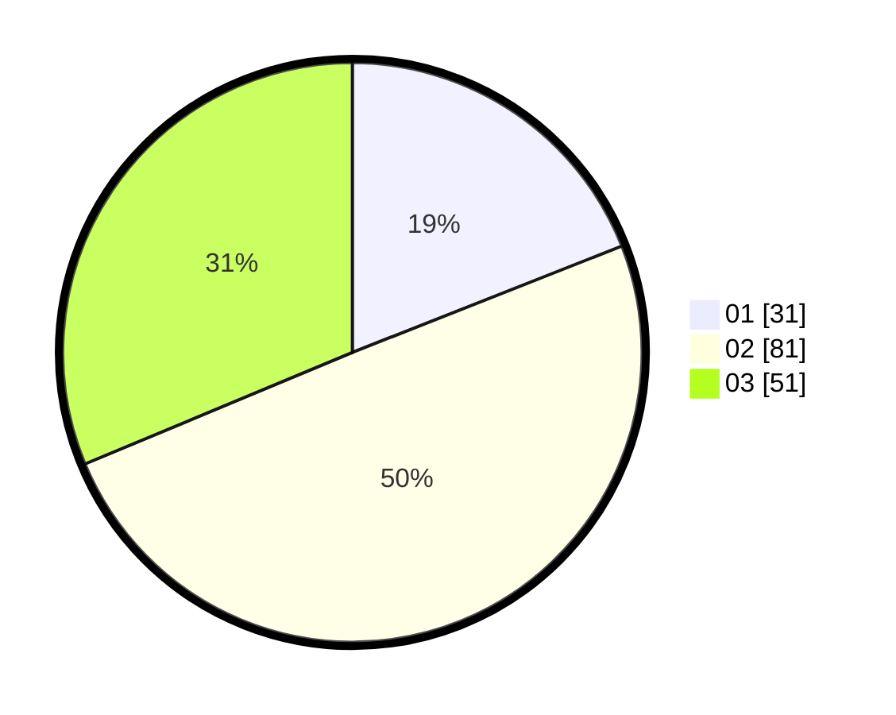

# Hasil

Hasil perolehan suara paslon dapat dilihat pada file paslon-01.txt, paslon-02.txt, dan paslon-03.txt.

Jika tidak ada, artinya data tersebut belum ada pada SIREKAP.

## Perolehan Suara

 * Paslon 01: **31**.
 * Paslon 02: **81**.
 * Paslon 03: **51**.

## Foto C Plano

https://sirekap-obj-formc.kpu.go.id/42d0/pemilu/ppwp/31/73/02/10/04/3173021004030-20240214-231700--e038de8c-f894-415a-afd5-937bb7e9faa7.jpg

https://sirekap-obj-formc.kpu.go.id/42d0/pemilu/ppwp/31/73/02/10/04/3173021004030-20240214-231808--5e5fc3a6-a98b-421a-83cb-68e007948f38.jpg

https://sirekap-obj-formc.kpu.go.id/42d0/pemilu/ppwp/31/73/02/10/04/3173021004030-20240214-231925--5c51f5f2-5963-412b-a776-0a9b69e8bdac.jpg
