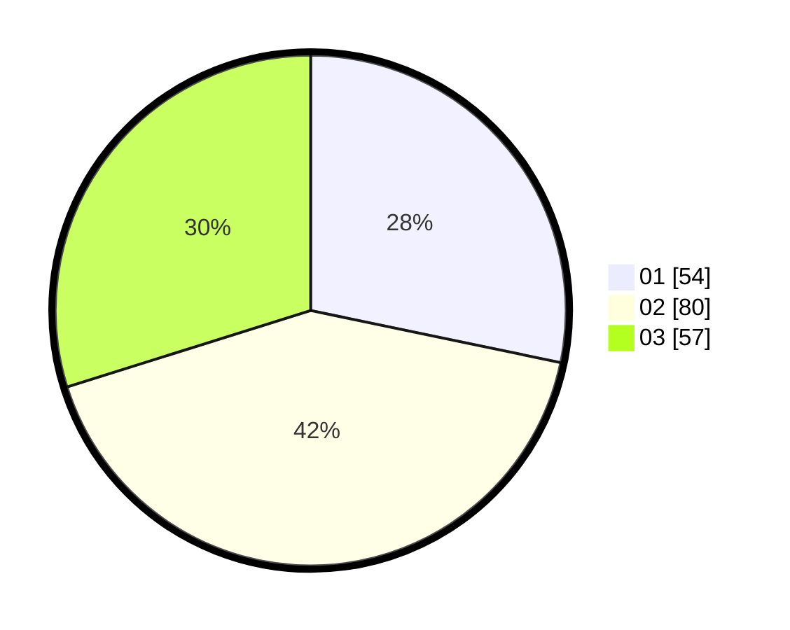

# Hasil

Hasil perolehan suara paslon dapat dilihat pada file paslon-01.txt, paslon-02.txt, dan paslon-03.txt.

Jika tidak ada, artinya data tersebut belum ada pada SIREKAP.

## Perolehan Suara

 * Paslon 01: **54**.
 * Paslon 02: **80**.
 * Paslon 03: **57**.

## Foto C Plano

https://sirekap-obj-formc.kpu.go.id/de3f/pemilu/ppwp/31/73/02/10/04/3173021004037-20240215-004156--443251f0-7510-4fb3-9b72-bdcdb3a0ab4e.jpg

https://sirekap-obj-formc.kpu.go.id/de3f/pemilu/ppwp/31/73/02/10/04/3173021004037-20240215-004305--359758e0-2fca-4e28-819a-2f9886a13f77.jpg

https://sirekap-obj-formc.kpu.go.id/de3f/pemilu/ppwp/31/73/02/10/04/3173021004037-20240214-212251--fceec611-7d0d-4d07-811e-bb9c659c42b4.jpg

## DATA PEMILIH TETAP

Jumlah pemilih dalam DPT: **259**.
 * L: **124**.
 * P: **135**.

## DATA PENGGUNA HAK PILIH

Jumlah pengguna hak pilih dalam DPT: **183**.
 * L: **88**.
 * P: **95**.

Jumlah pengguna hak pilih dalam DPTb: **6**.
 * L: **3**.
 * P: **3**.

Jumlah pengguna hak pilih dalam DPK: **6**.
 * L: **3**.
 * P: **3**.

Jumlah pengguna hak pilih: **195**.
 * L: **94**.
 * P: **101**.

## JUMLAH SUARA SAH DAN TIDAK SAH

JUMLAH SELURUH SUARA SAH: **191**.

JUMLAH SUARA TIDAK SAH: **4**.

JUMLAH SELURUH SUARA SAH DAN SUARA TIDAK SAH: **195**.
