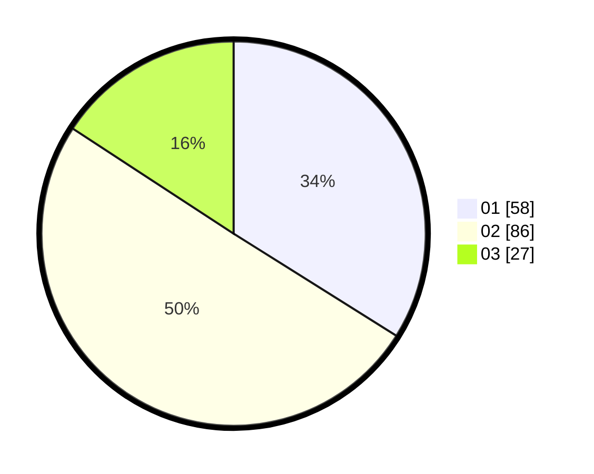

# Hasil

Hasil perolehan suara paslon dapat dilihat pada file paslon-01.txt, paslon-02.txt, dan paslon-03.txt.

Jika tidak ada, artinya data tersebut belum ada pada SIREKAP.

## Perolehan Suara

 * Paslon 01: **58**.
 * Paslon 02: **86**.
 * Paslon 03: **27**.

## Foto C Plano

https://sirekap-obj-formc.kpu.go.id/8a40/pemilu/ppwp/31/73/02/10/04/3173021004038-20240215-030527--e12f1473-8e3d-471c-b1b6-33c5c2ec0d7d.jpg

https://sirekap-obj-formc.kpu.go.id/8a40/pemilu/ppwp/31/73/02/10/04/3173021004038-20240215-030618--a53b733f-246b-4e25-ac06-9fbcc9cfae44.jpg
