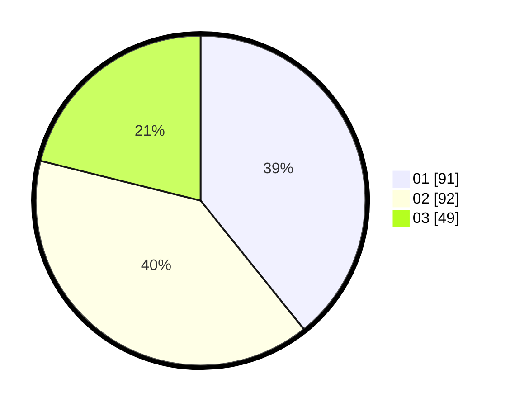

# Hasil

Hasil perolehan suara paslon dapat dilihat pada file paslon-01.txt, paslon-02.txt, dan paslon-03.txt.

Jika tidak ada, artinya data tersebut belum ada pada SIREKAP.

## Perolehan Suara

 * Paslon 01: **91**.
 * Paslon 02: **92**.
 * Paslon 03: **49**.

## Foto C Plano

https://sirekap-obj-formc.kpu.go.id/b2c0/pemilu/ppwp/31/73/02/10/04/3173021004040-20240214-231928--41429afc-3f8d-4467-a0a2-3ee8277ecb39.jpg

https://sirekap-obj-formc.kpu.go.id/b2c0/pemilu/ppwp/31/73/02/10/04/3173021004040-20240214-232206--96f86e22-1f78-4d78-a142-ac2534610ee3.jpg
