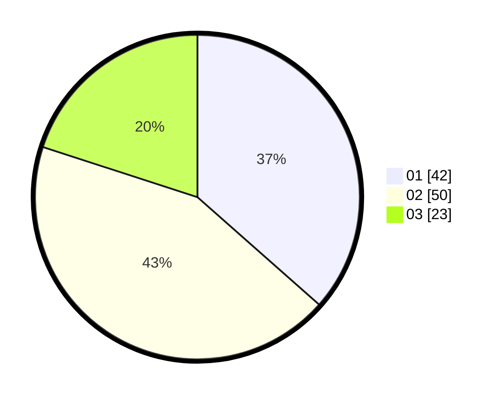

# Hasil

Hasil perolehan suara paslon dapat dilihat pada file paslon-01.txt, paslon-02.txt, dan paslon-03.txt.

Jika tidak ada, artinya data tersebut belum ada pada SIREKAP.

## Perolehan Suara

 * Paslon 01: **42**.
 * Paslon 02: **50**.
 * Paslon 03: **23**.

## Foto C Plano

https://sirekap-obj-formc.kpu.go.id/2696/pemilu/ppwp/31/73/02/10/04/3173021004042-20240214-202912--d87740ab-e0ab-45d5-b946-74afe5fe487f.jpg

https://sirekap-obj-formc.kpu.go.id/2696/pemilu/ppwp/31/73/02/10/04/3173021004042-20240214-203227--503869eb-d1e8-4837-96ea-7c6c4e8f7b64.jpg

https://sirekap-obj-formc.kpu.go.id/2696/pemilu/ppwp/31/73/02/10/04/3173021004042-20240214-203036--bc6adfe6-b962-408e-927b-8965cde78fcc.jpg

## DATA PEMILIH TETAP

Jumlah pemilih dalam DPT: **160**.
 * L: **74**.
 * P: **86**.

## DATA PENGGUNA HAK PILIH

Jumlah pengguna hak pilih dalam DPT: **110**.
 * L: **52**.
 * P: **58**.

Jumlah pengguna hak pilih dalam DPTb: **1**.
 * L: **0**.
 * P: **1**.

Jumlah pengguna hak pilih dalam DPK: **8**.
 * L: **3**.
 * P: **5**.

Jumlah pengguna hak pilih: **119**.
 * L: **55**.
 * P: **64**.

## JUMLAH SUARA SAH DAN TIDAK SAH

JUMLAH SELURUH SUARA SAH: **115**.

JUMLAH SUARA TIDAK SAH: **4**.

JUMLAH SELURUH SUARA SAH DAN SUARA TIDAK SAH: **119**.
