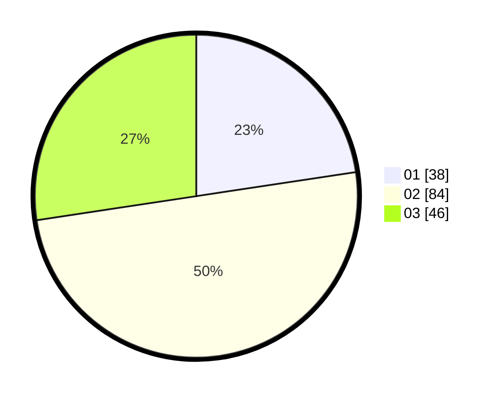

# Hasil

Hasil perolehan suara paslon dapat dilihat pada file paslon-01.txt, paslon-02.txt, dan paslon-03.txt.

Jika tidak ada, artinya data tersebut belum ada pada SIREKAP.

## Perolehan Suara

 * Paslon 01: **38**.
 * Paslon 02: **84**.
 * Paslon 03: **46**.

## Foto C Plano

https://sirekap-obj-formc.kpu.go.id/3936/pemilu/ppwp/31/73/02/10/04/3173021004045-20240215-222254--322d80b8-996b-4bd6-9269-24384ad2e979.jpg

https://sirekap-obj-formc.kpu.go.id/3936/pemilu/ppwp/31/73/02/10/04/3173021004045-20240215-222256--5d92ff7b-02bd-479f-90b0-9f43a170dba3.jpg

https://sirekap-obj-formc.kpu.go.id/3936/pemilu/ppwp/31/73/02/10/04/3173021004045-20240215-222255--37c70066-df52-498f-b05c-1c600a5c3c7d.jpg

## DATA PEMILIH TETAP

Jumlah pemilih dalam DPT: **212**.
 * L: **104**.
 * P: **108**.

## DATA PENGGUNA HAK PILIH

Jumlah pengguna hak pilih dalam DPT: **164**.
 * L: **79**.
 * P: **85**.

Jumlah pengguna hak pilih dalam DPTb: **4**.
 * L: **1**.
 * P: **3**.

Jumlah pengguna hak pilih dalam DPK: **1**.
 * L: **1**.
 * P: **0**.

Jumlah pengguna hak pilih: **169**.
 * L: **81**.
 * P: **88**.

## JUMLAH SUARA SAH DAN TIDAK SAH

JUMLAH SELURUH SUARA SAH: **168**.

JUMLAH SUARA TIDAK SAH: **1**.

JUMLAH SELURUH SUARA SAH DAN SUARA TIDAK SAH: **169**.
