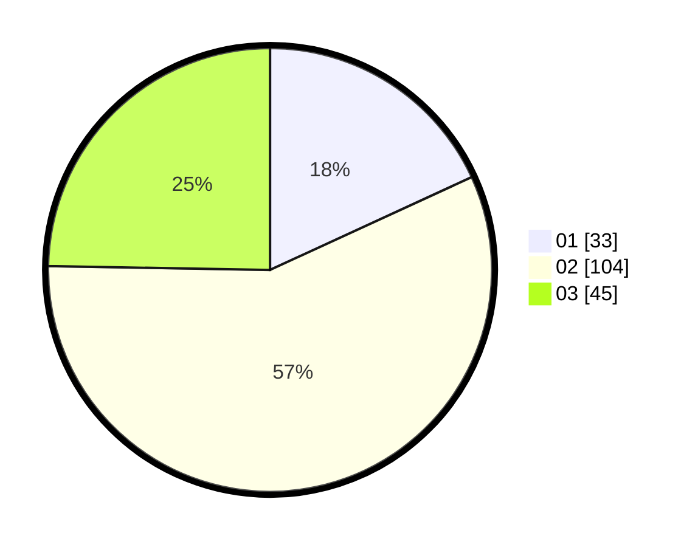

# Hasil

Hasil perolehan suara paslon dapat dilihat pada file paslon-01.txt, paslon-02.txt, dan paslon-03.txt.

Jika tidak ada, artinya data tersebut belum ada pada SIREKAP.

## Perolehan Suara

 * Paslon 01: **33**.
 * Paslon 02: **104**.
 * Paslon 03: **45**.

## Foto C Plano

https://sirekap-obj-formc.kpu.go.id/b119/pemilu/ppwp/31/73/02/10/04/3173021004051-20240214-234724--25cd480d-8868-4551-b2d2-ce0d1d59e58e.jpg

https://sirekap-obj-formc.kpu.go.id/b119/pemilu/ppwp/31/73/02/10/04/3173021004051-20240214-234826--716643e7-4e8a-448c-bae7-654fb359d6ec.jpg

https://sirekap-obj-formc.kpu.go.id/b119/pemilu/ppwp/31/73/02/10/04/3173021004051-20240214-234911--4e1504d4-3fba-4bf9-ae92-b709de318438.jpg
