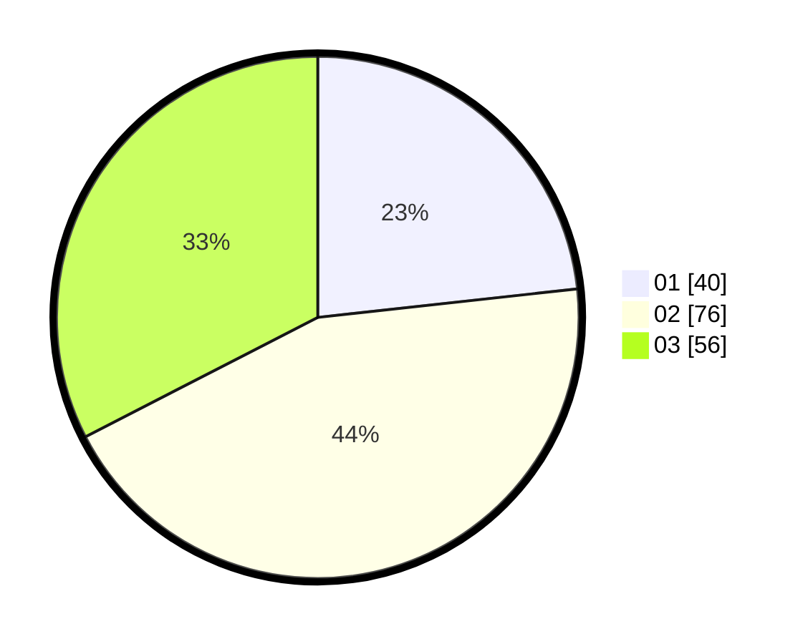

# Hasil

Hasil perolehan suara paslon dapat dilihat pada file paslon-01.txt, paslon-02.txt, dan paslon-03.txt.

Jika tidak ada, artinya data tersebut belum ada pada SIREKAP.

## Perolehan Suara

 * Paslon 01: **40**.
 * Paslon 02: **76**.
 * Paslon 03: **56**.

## Foto C Plano

https://sirekap-obj-formc.kpu.go.id/f226/pemilu/ppwp/31/73/02/10/04/3173021004052-20240216-141240--7859edc8-0b3a-4e15-9b3d-70d32c818d28.jpg

https://sirekap-obj-formc.kpu.go.id/f226/pemilu/ppwp/31/73/02/10/04/3173021004052-20240216-141241--71e089aa-8ed9-4b6a-af18-c62c83feaa5b.jpg

https://sirekap-obj-formc.kpu.go.id/f226/pemilu/ppwp/31/73/02/10/04/3173021004052-20240216-141241--9b068277-942d-42ed-ba11-27efc82ea4e2.jpg

## DATA PEMILIH TETAP

Jumlah pemilih dalam DPT: **207**.
 * L: **108**.
 * P: **99**.

## DATA PENGGUNA HAK PILIH

Jumlah pengguna hak pilih dalam DPT: **161**.
 * L: **80**.
 * P: **81**.

Jumlah pengguna hak pilih dalam DPTb: **12**.
 * L: **9**.
 * P: **3**.

Jumlah pengguna hak pilih dalam DPK: **0**.
 * L: **0**.
 * P: **0**.

Jumlah pengguna hak pilih: **173**.
 * L: **89**.
 * P: **84**.

## JUMLAH SUARA SAH DAN TIDAK SAH

JUMLAH SELURUH SUARA SAH: **172**.

JUMLAH SUARA TIDAK SAH: **1**.

JUMLAH SELURUH SUARA SAH DAN SUARA TIDAK SAH: **173**.
