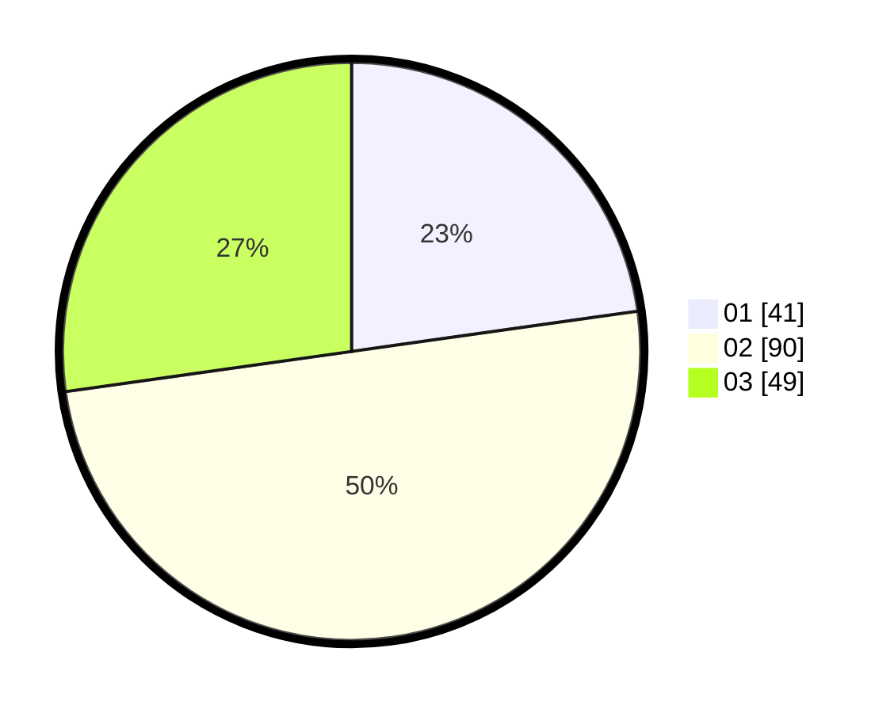

# Hasil

Hasil perolehan suara paslon dapat dilihat pada file paslon-01.txt, paslon-02.txt, dan paslon-03.txt.

Jika tidak ada, artinya data tersebut belum ada pada SIREKAP.

## Perolehan Suara

 * Paslon 01: **41**.
 * Paslon 02: **90**.
 * Paslon 03: **49**.

## Foto C Plano

https://sirekap-obj-formc.kpu.go.id/a28d/pemilu/ppwp/31/73/02/10/04/3173021004055-20240214-235232--93981cc0-085c-48c1-a25c-9174cd9bab93.jpg

https://sirekap-obj-formc.kpu.go.id/a28d/pemilu/ppwp/31/73/02/10/04/3173021004055-20240214-235509--4e769276-4ddf-429f-a214-b623fb920a4b.jpg

https://sirekap-obj-formc.kpu.go.id/a28d/pemilu/ppwp/31/73/02/10/04/3173021004055-20240214-235607--5cb32aad-30b4-4f37-848d-2dc13d0ebde2.jpg
