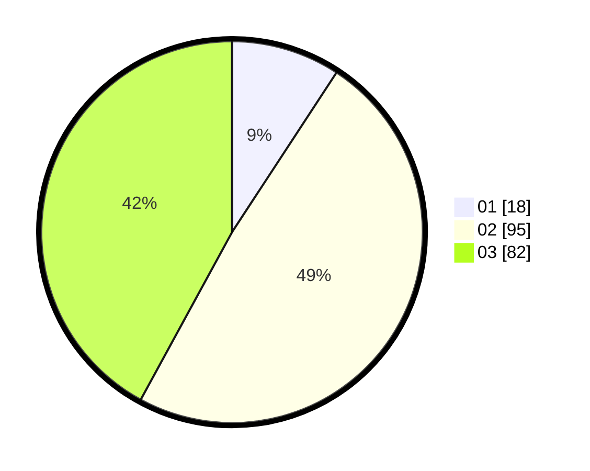

# Hasil

Hasil perolehan suara paslon dapat dilihat pada file paslon-01.txt, paslon-02.txt, dan paslon-03.txt.

Jika tidak ada, artinya data tersebut belum ada pada SIREKAP.

## Perolehan Suara

 * Paslon 01: **18**.
 * Paslon 02: **95**.
 * Paslon 03: **82**.

## Foto C Plano

https://sirekap-obj-formc.kpu.go.id/8ad4/pemilu/ppwp/31/73/02/10/04/3173021004061-20240214-210723--1e07f802-214d-4846-a76b-a9d22a5ec967.jpg

https://sirekap-obj-formc.kpu.go.id/8ad4/pemilu/ppwp/31/73/02/10/04/3173021004061-20240214-210744--d41ed7cb-a470-4183-92aa-710ba3265b20.jpg

https://sirekap-obj-formc.kpu.go.id/8ad4/pemilu/ppwp/31/73/02/10/04/3173021004061-20240214-210811--4ae32a28-3330-4361-846e-88d37a6c7eb3.jpg

## DATA PEMILIH TETAP

Jumlah pemilih dalam DPT: **239**.
 * L: **110**.
 * P: **129**.

## DATA PENGGUNA HAK PILIH

Jumlah pengguna hak pilih dalam DPT: **185**.
 * L: **82**.
 * P: **103**.

Jumlah pengguna hak pilih dalam DPTb: **13**.
 * L: **9**.
 * P: **4**.

Jumlah pengguna hak pilih dalam DPK: **1**.
 * L: **1**.
 * P: **0**.

Jumlah pengguna hak pilih: **199**.
 * L: **92**.
 * P: **107**.

## JUMLAH SUARA SAH DAN TIDAK SAH

JUMLAH SELURUH SUARA SAH: **195**.

JUMLAH SUARA TIDAK SAH: **4**.

JUMLAH SELURUH SUARA SAH DAN SUARA TIDAK SAH: **199**.
