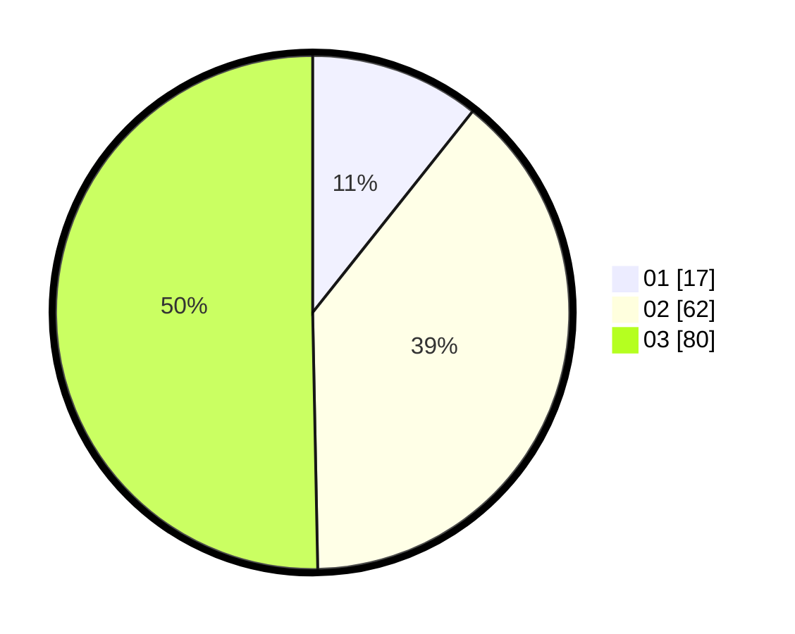

# Hasil

Hasil perolehan suara paslon dapat dilihat pada file paslon-01.txt, paslon-02.txt, dan paslon-03.txt.

Jika tidak ada, artinya data tersebut belum ada pada SIREKAP.

## Perolehan Suara

 * Paslon 01: **17**.
 * Paslon 02: **62**.
 * Paslon 03: **80**.

## Foto C Plano

https://sirekap-obj-formc.kpu.go.id/05ae/pemilu/ppwp/31/73/02/10/04/3173021004063-20240214-200950--9c3555c3-ded3-4084-a6cb-1d6721e275ff.jpg

https://sirekap-obj-formc.kpu.go.id/05ae/pemilu/ppwp/31/73/02/10/04/3173021004063-20240214-200952--19918176-d9b5-42c9-b6f0-e4ae4d31a540.jpg

https://sirekap-obj-formc.kpu.go.id/05ae/pemilu/ppwp/31/73/02/10/04/3173021004063-20240214-200956--41359927-70cb-4ad9-ab3b-1a6d4c341373.jpg
