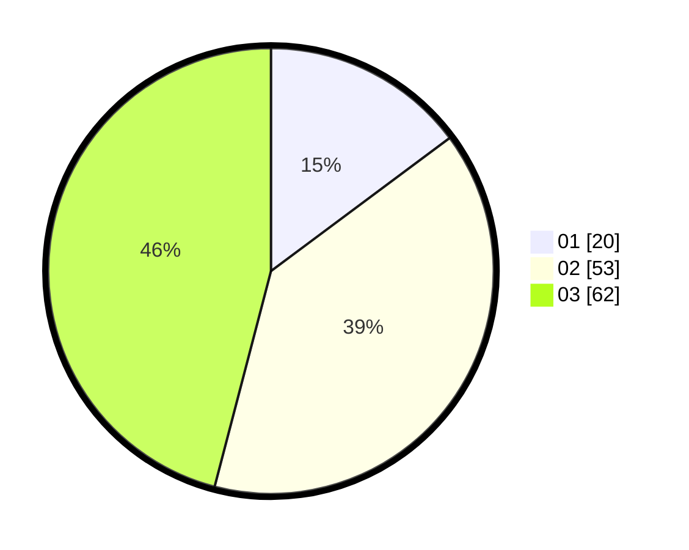

# Hasil

Hasil perolehan suara paslon dapat dilihat pada file paslon-01.txt, paslon-02.txt, dan paslon-03.txt.

Jika tidak ada, artinya data tersebut belum ada pada SIREKAP.

## Perolehan Suara

 * Paslon 01: **20**.
 * Paslon 02: **53**.
 * Paslon 03: **62**.

## Foto C Plano

https://sirekap-obj-formc.kpu.go.id/4e23/pemilu/ppwp/31/73/02/10/04/3173021004064-20240214-222802--899f4aa6-06da-4aee-b88e-ddca5e95dfb6.jpg

https://sirekap-obj-formc.kpu.go.id/4e23/pemilu/ppwp/31/73/02/10/04/3173021004064-20240214-224008--6a37fbeb-cb9b-441e-858c-490efd1417fb.jpg

https://sirekap-obj-formc.kpu.go.id/4e23/pemilu/ppwp/31/73/02/10/04/3173021004064-20240214-224111--d51d8c2d-b76b-436e-a41e-23aee8abbdb5.jpg
