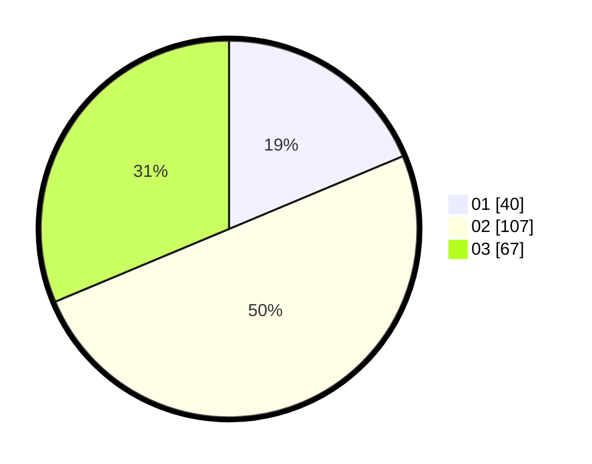

# Hasil

Hasil perolehan suara paslon dapat dilihat pada file paslon-01.txt, paslon-02.txt, dan paslon-03.txt.

Jika tidak ada, artinya data tersebut belum ada pada SIREKAP.

## Perolehan Suara

 * Paslon 01: **40**.
 * Paslon 02: **107**.
 * Paslon 03: **67**.

## Foto C Plano

https://sirekap-obj-formc.kpu.go.id/7d2d/pemilu/ppwp/31/73/02/10/04/3173021004065-20240215-141731--4191424f-2b19-41fc-8512-ea15f583325e.jpg

https://sirekap-obj-formc.kpu.go.id/7d2d/pemilu/ppwp/31/73/02/10/04/3173021004065-20240215-183901--bf930e09-1e70-412b-ba42-3f0848677d43.jpg

https://sirekap-obj-formc.kpu.go.id/7d2d/pemilu/ppwp/31/73/02/10/04/3173021004065-20240215-184010--abd1485a-4c85-4716-b383-8e1925ecaa6b.jpg

## DATA PEMILIH TETAP

Jumlah pemilih dalam DPT: **288**.
 * L: **150**.
 * P: **138**.

## DATA PENGGUNA HAK PILIH

Jumlah pengguna hak pilih dalam DPT: **213**.
 * L: **105**.
 * P: **108**.

Jumlah pengguna hak pilih dalam DPTb: **0**.
 * L: **0**.
 * P: **0**.

Jumlah pengguna hak pilih dalam DPK: **5**.
 * L: **2**.
 * P: **3**.

Jumlah pengguna hak pilih: **218**.
 * L: **107**.
 * P: **111**.

## JUMLAH SUARA SAH DAN TIDAK SAH

JUMLAH SELURUH SUARA SAH: **214**.

JUMLAH SUARA TIDAK SAH: **4**.

JUMLAH SELURUH SUARA SAH DAN SUARA TIDAK SAH: **218**.
