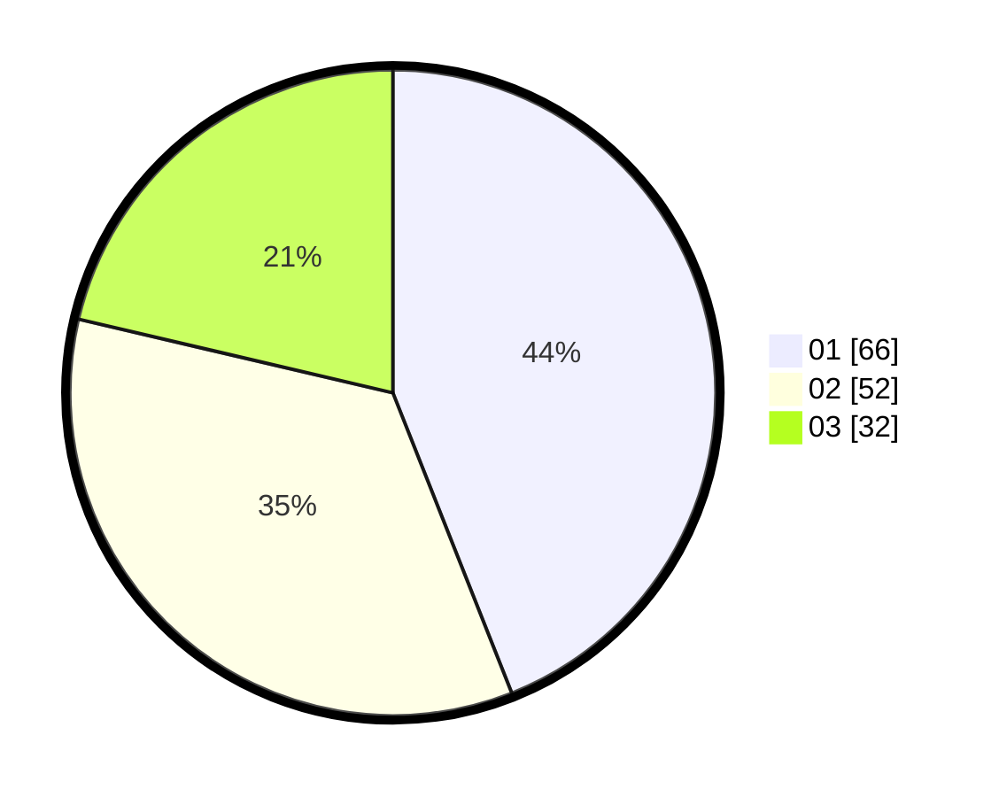

# Hasil

Hasil perolehan suara paslon dapat dilihat pada file paslon-01.txt, paslon-02.txt, dan paslon-03.txt.

Jika tidak ada, artinya data tersebut belum ada pada SIREKAP.

## Perolehan Suara

 * Paslon 01: **66**.
 * Paslon 02: **52**.
 * Paslon 03: **32**.

## Foto C Plano

https://sirekap-obj-formc.kpu.go.id/0215/pemilu/ppwp/31/73/02/10/04/3173021004072-20240214-202124--5d055442-1065-4032-b9f3-c73630c832a4.jpg

https://sirekap-obj-formc.kpu.go.id/0215/pemilu/ppwp/31/73/02/10/04/3173021004072-20240214-202206--75d19b82-2af9-406c-b1f2-fc5d946f794c.jpg

https://sirekap-obj-formc.kpu.go.id/0215/pemilu/ppwp/31/73/02/10/04/3173021004072-20240214-202234--774b04b2-66de-4abe-8c80-cb78307fe003.jpg

## DATA PEMILIH TETAP

Jumlah pemilih dalam DPT: **245**.
 * L: **125**.
 * P: **120**.

## DATA PENGGUNA HAK PILIH

Jumlah pengguna hak pilih dalam DPT: **151**.
 * L: **71**.
 * P: **80**.

Jumlah pengguna hak pilih dalam DPTb: **1**.
 * L: **1**.
 * P: **0**.

Jumlah pengguna hak pilih dalam DPK: **1**.
 * L: **0**.
 * P: **1**.

Jumlah pengguna hak pilih: **153**.
 * L: **72**.
 * P: **81**.

## JUMLAH SUARA SAH DAN TIDAK SAH

JUMLAH SELURUH SUARA SAH: **150**.

JUMLAH SUARA TIDAK SAH: **3**.

JUMLAH SELURUH SUARA SAH DAN SUARA TIDAK SAH: **153**.
