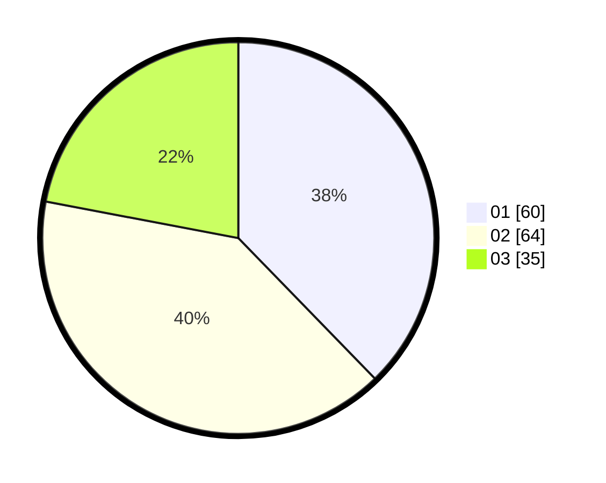

# Hasil

Hasil perolehan suara paslon dapat dilihat pada file paslon-01.txt, paslon-02.txt, dan paslon-03.txt.

Jika tidak ada, artinya data tersebut belum ada pada SIREKAP.

## Perolehan Suara

 * Paslon 01: **60**.
 * Paslon 02: **64**.
 * Paslon 03: **35**.

## Foto C Plano

https://sirekap-obj-formc.kpu.go.id/6dc7/pemilu/ppwp/31/73/02/10/04/3173021004073-20240214-200403--682245f7-6dff-45e7-9fe9-92d854b5154e.jpg

https://sirekap-obj-formc.kpu.go.id/6dc7/pemilu/ppwp/31/73/02/10/04/3173021004073-20240214-200413--821e88f4-a14a-46ef-96e2-2cf4bf1d9554.jpg

https://sirekap-obj-formc.kpu.go.id/6dc7/pemilu/ppwp/31/73/02/10/04/3173021004073-20240214-200421--bd9df748-b4b0-400a-967c-a5e811660a03.jpg

## DATA PEMILIH TETAP

Jumlah pemilih dalam DPT: **243**.
 * L: **129**.
 * P: **114**.

## DATA PENGGUNA HAK PILIH

Jumlah pengguna hak pilih dalam DPT: **158**.
 * L: **84**.
 * P: **74**.

Jumlah pengguna hak pilih dalam DPTb: **0**.
 * L: **0**.
 * P: **0**.

Jumlah pengguna hak pilih dalam DPK: **3**.
 * L: **2**.
 * P: **1**.

Jumlah pengguna hak pilih: **161**.
 * L: **86**.
 * P: **75**.

## JUMLAH SUARA SAH DAN TIDAK SAH

JUMLAH SELURUH SUARA SAH: **161**.

JUMLAH SUARA TIDAK SAH: **0**.

JUMLAH SELURUH SUARA SAH DAN SUARA TIDAK SAH: **161**.
