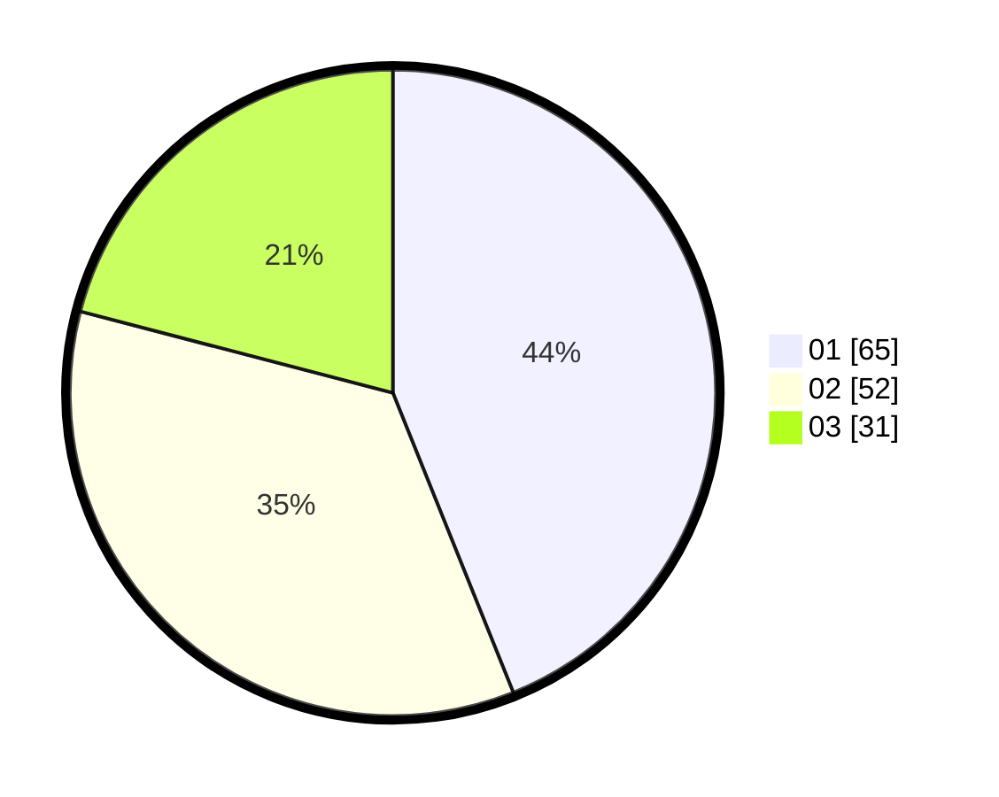

# Hasil

Hasil perolehan suara paslon dapat dilihat pada file paslon-01.txt, paslon-02.txt, dan paslon-03.txt.

Jika tidak ada, artinya data tersebut belum ada pada SIREKAP.

## Perolehan Suara

 * Paslon 01: **65**.
 * Paslon 02: **52**.
 * Paslon 03: **31**.

## Foto C Plano

https://sirekap-obj-formc.kpu.go.id/022f/pemilu/ppwp/31/73/02/10/04/3173021004074-20240214-192600--5735cfe5-0791-4d67-8867-7258c27ebdc1.jpg

https://sirekap-obj-formc.kpu.go.id/022f/pemilu/ppwp/31/73/02/10/04/3173021004074-20240214-195423--d0c0784b-409e-4ee6-aa29-44c1b6835c26.jpg

https://sirekap-obj-formc.kpu.go.id/022f/pemilu/ppwp/31/73/02/10/04/3173021004074-20240214-195835--e2417147-e4e5-468a-9240-e038083d3118.jpg

## DATA PEMILIH TETAP

Jumlah pemilih dalam DPT: **241**.
 * L: **124**.
 * P: **117**.

## DATA PENGGUNA HAK PILIH

Jumlah pengguna hak pilih dalam DPT: **148**.
 * L: **73**.
 * P: **75**.

Jumlah pengguna hak pilih dalam DPTb: **0**.
 * L: **0**.
 * P: **0**.

Jumlah pengguna hak pilih dalam DPK: **4**.
 * L: **3**.
 * P: **1**.

Jumlah pengguna hak pilih: **152**.
 * L: **76**.
 * P: **76**.

## JUMLAH SUARA SAH DAN TIDAK SAH

JUMLAH SELURUH SUARA SAH: **148**.

JUMLAH SUARA TIDAK SAH: **4**.

JUMLAH SELURUH SUARA SAH DAN SUARA TIDAK SAH: **152**.
