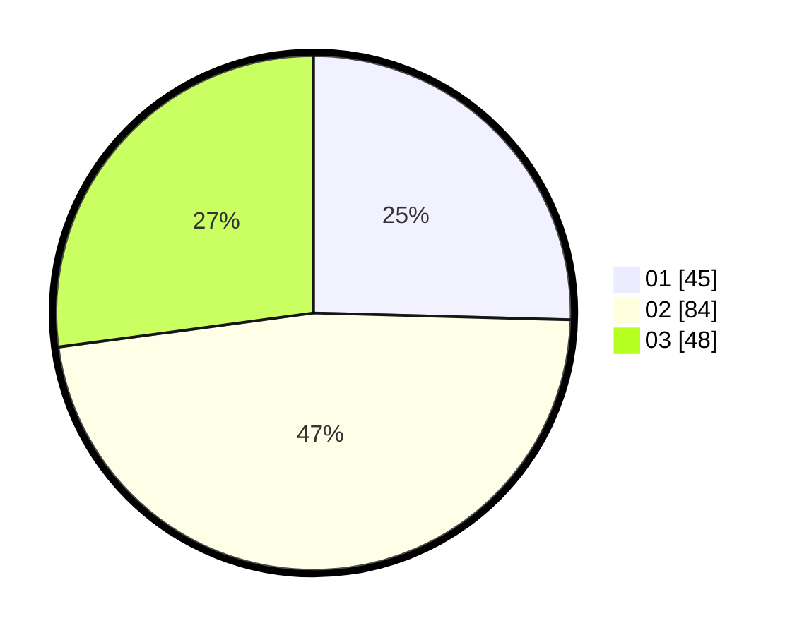

# Hasil

Hasil perolehan suara paslon dapat dilihat pada file paslon-01.txt, paslon-02.txt, dan paslon-03.txt.

Jika tidak ada, artinya data tersebut belum ada pada SIREKAP.

## Perolehan Suara

 * Paslon 01: **45**.
 * Paslon 02: **84**.
 * Paslon 03: **48**.

## Foto C Plano

https://sirekap-obj-formc.kpu.go.id/371a/pemilu/ppwp/31/73/02/10/04/3173021004075-20240214-220702--c410495f-2d61-4e0c-a574-4cdd102ffc49.jpg

https://sirekap-obj-formc.kpu.go.id/371a/pemilu/ppwp/31/73/02/10/04/3173021004075-20240214-220731--83fbb258-8d64-42d3-864f-5cbea2e082ef.jpg

https://sirekap-obj-formc.kpu.go.id/371a/pemilu/ppwp/31/73/02/10/04/3173021004075-20240214-220757--92fbda40-aead-4a83-a825-60b69b52c02f.jpg
