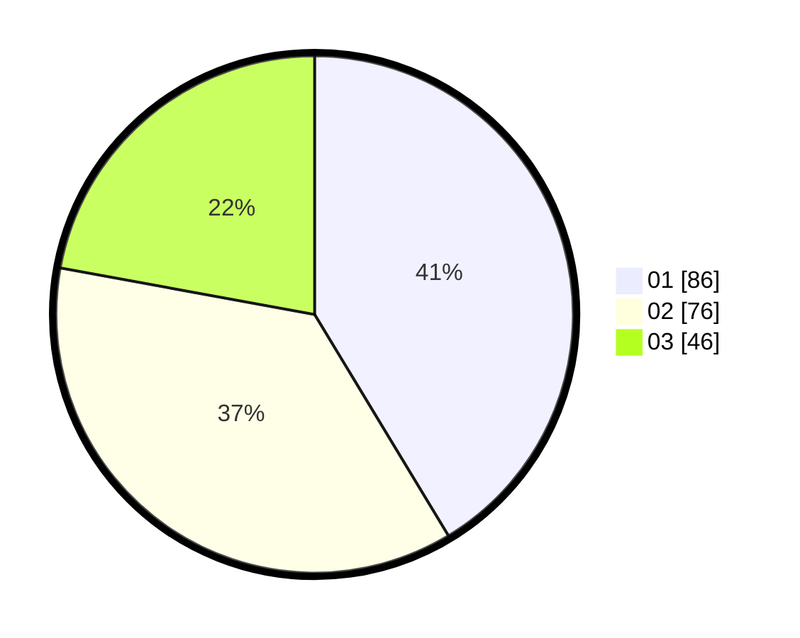

# Hasil

Hasil perolehan suara paslon dapat dilihat pada file paslon-01.txt, paslon-02.txt, dan paslon-03.txt.

Jika tidak ada, artinya data tersebut belum ada pada SIREKAP.

## Perolehan Suara

 * Paslon 01: **86**.
 * Paslon 02: **76**.
 * Paslon 03: **46**.

## Foto C Plano

https://sirekap-obj-formc.kpu.go.id/eef7/pemilu/ppwp/31/73/02/10/04/3173021004077-20240215-004553--08d3b4a7-1a9e-4b81-8246-3d0e1307c396.jpg

https://sirekap-obj-formc.kpu.go.id/eef7/pemilu/ppwp/31/73/02/10/04/3173021004077-20240215-004631--55ffb2d8-c491-4cda-8bff-f61e40cb8d26.jpg

https://sirekap-obj-formc.kpu.go.id/eef7/pemilu/ppwp/31/73/02/10/04/3173021004077-20240215-004732--2fe9dc61-398c-4ac9-a26e-3965d3811e04.jpg
