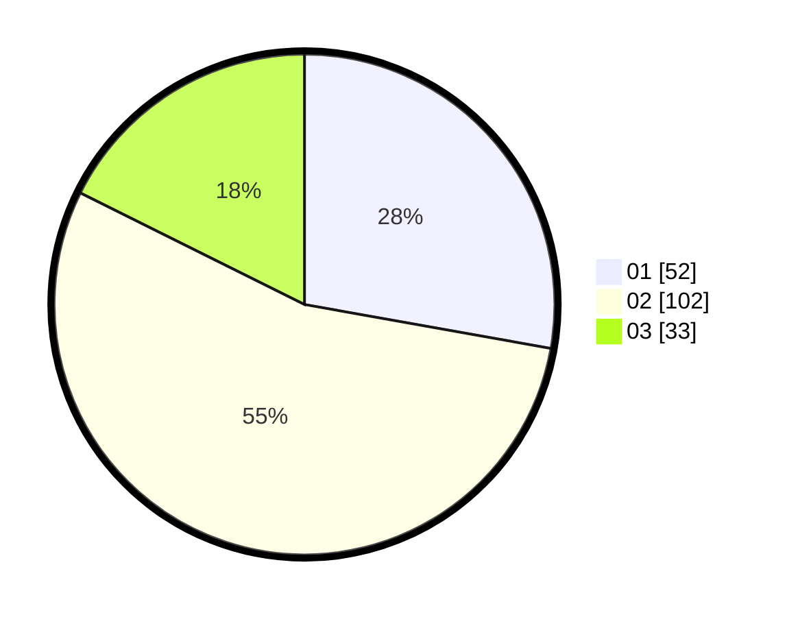

# Hasil

Hasil perolehan suara paslon dapat dilihat pada file paslon-01.txt, paslon-02.txt, dan paslon-03.txt.

Jika tidak ada, artinya data tersebut belum ada pada SIREKAP.

## Perolehan Suara

 * Paslon 01: **52**.
 * Paslon 02: **102**.
 * Paslon 03: **33**.

## Foto C Plano

https://sirekap-obj-formc.kpu.go.id/89d4/pemilu/ppwp/31/73/02/10/04/3173021004079-20240214-200025--5217a796-5fa3-45c7-8be8-71941bab44f4.jpg

https://sirekap-obj-formc.kpu.go.id/89d4/pemilu/ppwp/31/73/02/10/04/3173021004079-20240214-200813--4ccee6c7-ead9-4f91-a94e-62cf67584f7a.jpg

https://sirekap-obj-formc.kpu.go.id/89d4/pemilu/ppwp/31/73/02/10/04/3173021004079-20240214-200454--6efc4ba7-f5f3-4037-8de2-1fa11590bb24.jpg
