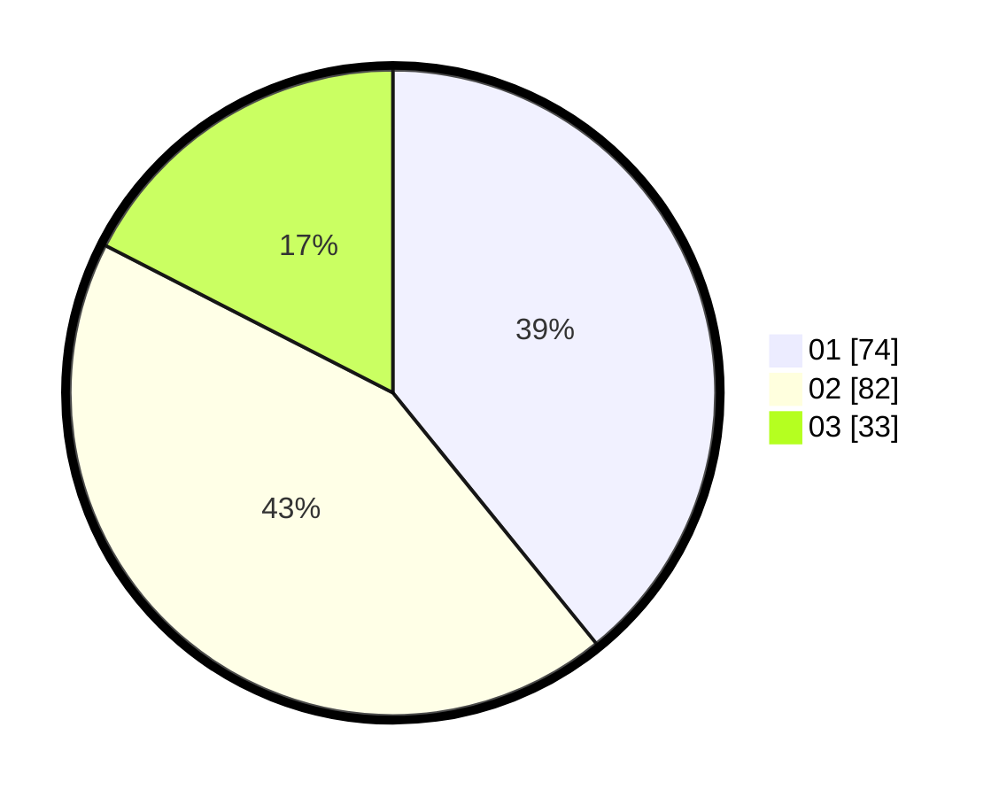

# Hasil

Hasil perolehan suara paslon dapat dilihat pada file paslon-01.txt, paslon-02.txt, dan paslon-03.txt.

Jika tidak ada, artinya data tersebut belum ada pada SIREKAP.

## Perolehan Suara

 * Paslon 01: **74**.
 * Paslon 02: **82**.
 * Paslon 03: **33**.

## Foto C Plano

https://sirekap-obj-formc.kpu.go.id/43de/pemilu/ppwp/31/73/02/10/04/3173021004082-20240214-220713--2c2392ba-e760-4839-93b3-a8b909de48a5.jpg

https://sirekap-obj-formc.kpu.go.id/43de/pemilu/ppwp/31/73/02/10/04/3173021004082-20240214-220753--96a2211b-b2ed-402b-b9f4-6368c14f7971.jpg

https://sirekap-obj-formc.kpu.go.id/43de/pemilu/ppwp/31/73/02/10/04/3173021004082-20240214-220806--8a0036d5-08fc-47c8-8a0f-8224f1f65d8c.jpg
