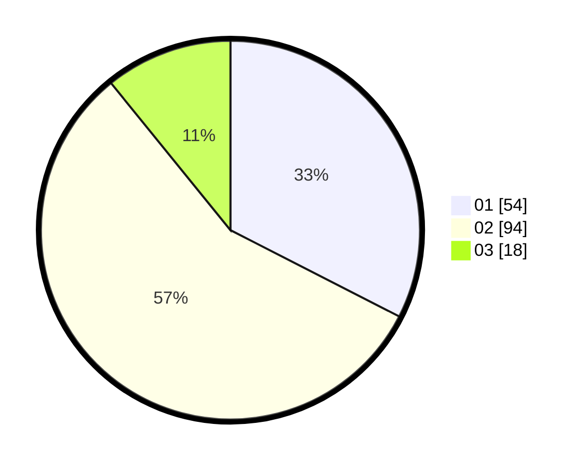

# Hasil

Hasil perolehan suara paslon dapat dilihat pada file paslon-01.txt, paslon-02.txt, dan paslon-03.txt.

Jika tidak ada, artinya data tersebut belum ada pada SIREKAP.

## Perolehan Suara

 * Paslon 01: **54**.
 * Paslon 02: **94**.
 * Paslon 03: **18**.

## Foto C Plano

https://sirekap-obj-formc.kpu.go.id/a1b3/pemilu/ppwp/31/73/02/10/04/3173021004084-20240214-223418--b274ee24-1039-4eaf-8267-592036ad78b6.jpg

https://sirekap-obj-formc.kpu.go.id/a1b3/pemilu/ppwp/31/73/02/10/04/3173021004084-20240214-224823--0381f48b-aa1a-4e33-a504-18e1a507f8ef.jpg

https://sirekap-obj-formc.kpu.go.id/a1b3/pemilu/ppwp/31/73/02/10/04/3173021004084-20240214-224844--d5872d43-63c0-4aa9-9577-ec2dbfe7e884.jpg
