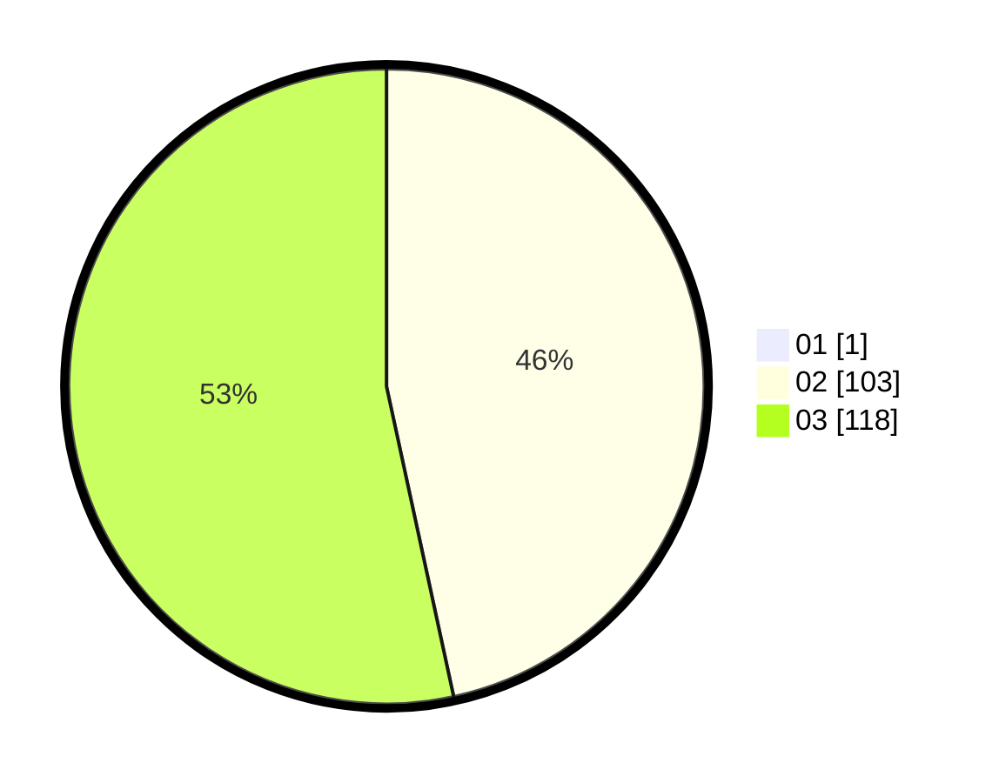

# Hasil

Hasil perolehan suara paslon dapat dilihat pada file paslon-01.txt, paslon-02.txt, dan paslon-03.txt.

Jika tidak ada, artinya data tersebut belum ada pada SIREKAP.

## Perolehan Suara

 * Paslon 01: **1**.
 * Paslon 02: **103**.
 * Paslon 03: **118**.

## Foto C Plano

https://sirekap-obj-formc.kpu.go.id/82ff/pemilu/ppwp/31/73/02/10/04/3173021004085-20240214-220336--8387da5e-6fc8-4a86-bb2b-cb2f41a6c9af.jpg

https://sirekap-obj-formc.kpu.go.id/82ff/pemilu/ppwp/31/73/02/10/04/3173021004085-20240214-220433--48d1cc6a-a447-40e4-9b6e-b69da40d789b.jpg

https://sirekap-obj-formc.kpu.go.id/82ff/pemilu/ppwp/31/73/02/10/04/3173021004085-20240214-220557--7c6ee0da-0e36-4945-9794-ae9d4ef7584e.jpg
