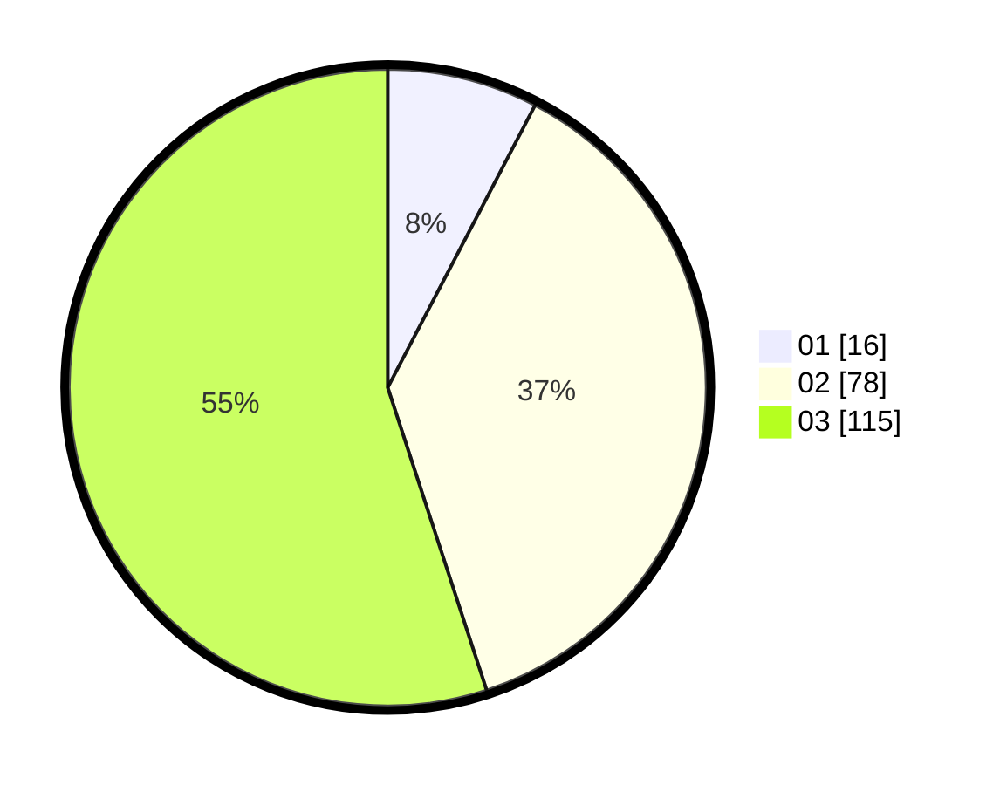

# Hasil

Hasil perolehan suara paslon dapat dilihat pada file paslon-01.txt, paslon-02.txt, dan paslon-03.txt.

Jika tidak ada, artinya data tersebut belum ada pada SIREKAP.

## Perolehan Suara

 * Paslon 01: **16**.
 * Paslon 02: **78**.
 * Paslon 03: **115**.

## Foto C Plano

https://sirekap-obj-formc.kpu.go.id/82c7/pemilu/ppwp/31/73/02/10/04/3173021004089-20240214-225025--21fb91cc-e9b0-453a-bde6-a1b5575f9e11.jpg

https://sirekap-obj-formc.kpu.go.id/82c7/pemilu/ppwp/31/73/02/10/04/3173021004089-20240214-225040--0e45808f-750e-4f76-b443-d9ff3ff81fda.jpg

https://sirekap-obj-formc.kpu.go.id/82c7/pemilu/ppwp/31/73/02/10/04/3173021004089-20240214-225056--e5db84bb-d2db-47a7-9c99-cb2c037656e8.jpg
