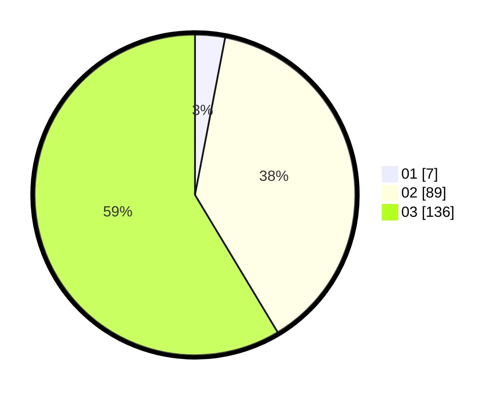

# Hasil

Hasil perolehan suara paslon dapat dilihat pada file paslon-01.txt, paslon-02.txt, dan paslon-03.txt.

Jika tidak ada, artinya data tersebut belum ada pada SIREKAP.

## Perolehan Suara

 * Paslon 01: **7**.
 * Paslon 02: **89**.
 * Paslon 03: **136**.

## Foto C Plano

https://sirekap-obj-formc.kpu.go.id/e41d/pemilu/ppwp/31/73/02/10/04/3173021004090-20240214-234452--0a036e4d-503b-4067-a78f-b595d5c2f442.jpg

https://sirekap-obj-formc.kpu.go.id/e41d/pemilu/ppwp/31/73/02/10/04/3173021004090-20240214-234542--fbfef921-52d2-4771-8c86-816a27ecca2e.jpg

https://sirekap-obj-formc.kpu.go.id/e41d/pemilu/ppwp/31/73/02/10/04/3173021004090-20240214-234628--b24b62dc-8caf-4fad-88f1-758fba5c5567.jpg
