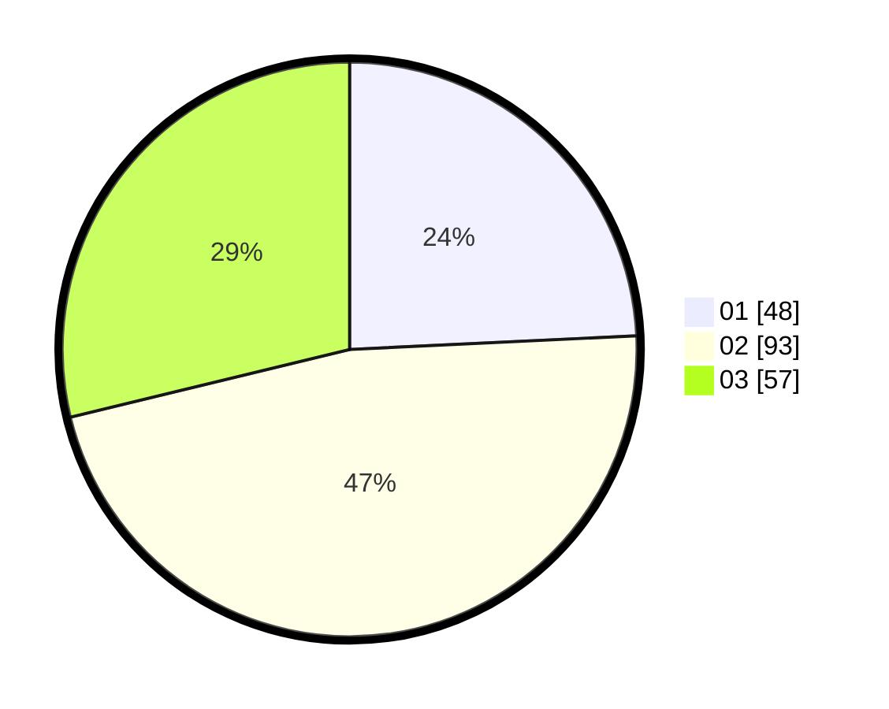

# Hasil

Hasil perolehan suara paslon dapat dilihat pada file paslon-01.txt, paslon-02.txt, dan paslon-03.txt.

Jika tidak ada, artinya data tersebut belum ada pada SIREKAP.

## Perolehan Suara

 * Paslon 01: **48**.
 * Paslon 02: **93**.
 * Paslon 03: **57**.

## Foto C Plano

https://sirekap-obj-formc.kpu.go.id/5813/pemilu/ppwp/31/73/02/10/04/3173021004093-20240214-224038--68c0dda6-9df5-4b0c-b91e-be2a5dec18be.jpg

https://sirekap-obj-formc.kpu.go.id/5813/pemilu/ppwp/31/73/02/10/04/3173021004093-20240214-224127--c189a1dd-ea01-453c-a75d-ae636c06a5f4.jpg

https://sirekap-obj-formc.kpu.go.id/5813/pemilu/ppwp/31/73/02/10/04/3173021004093-20240214-222737--513d1ccf-c495-4b7d-915f-bc581d4faca6.jpg
