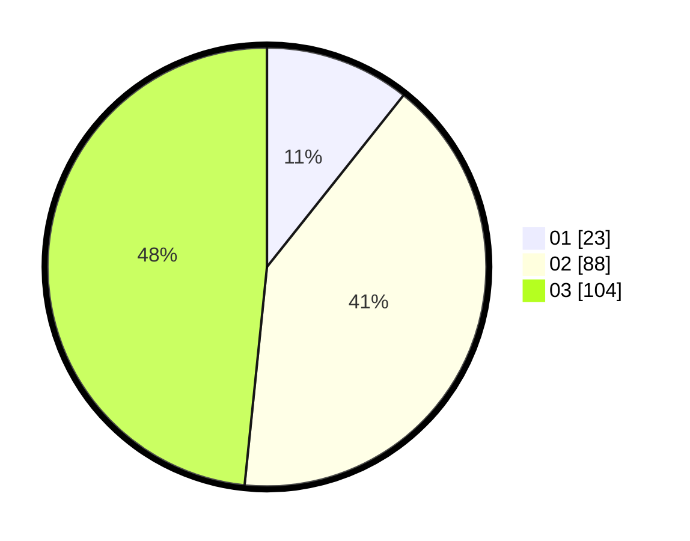

# Hasil

Hasil perolehan suara paslon dapat dilihat pada file paslon-01.txt, paslon-02.txt, dan paslon-03.txt.

Jika tidak ada, artinya data tersebut belum ada pada SIREKAP.

## Perolehan Suara

 * Paslon 01: **23**.
 * Paslon 02: **88**.
 * Paslon 03: **104**.

## Foto C Plano

https://sirekap-obj-formc.kpu.go.id/4cd1/pemilu/ppwp/31/73/02/10/04/3173021004095-20240214-210541--bc9b48dd-4067-4166-bb26-4c62496a2b67.jpg

https://sirekap-obj-formc.kpu.go.id/4cd1/pemilu/ppwp/31/73/02/10/04/3173021004095-20240214-210743--0568c5bd-a26b-4c38-be0e-ba146a5123e7.jpg

https://sirekap-obj-formc.kpu.go.id/4cd1/pemilu/ppwp/31/73/02/10/04/3173021004095-20240214-210909--d3f41ec7-4f09-4c71-abb9-2585844de7ee.jpg

## DATA PEMILIH TETAP

Jumlah pemilih dalam DPT: **276**.
 * L: **122**.
 * P: **154**.

## DATA PENGGUNA HAK PILIH

Jumlah pengguna hak pilih dalam DPT: **205**.
 * L: **89**.
 * P: **116**.

Jumlah pengguna hak pilih dalam DPTb: **0**.
 * L: **0**.
 * P: **0**.

Jumlah pengguna hak pilih dalam DPK: **10**.
 * L: **5**.
 * P: **5**.

Jumlah pengguna hak pilih: **215**.
 * L: **94**.
 * P: **121**.

## JUMLAH SUARA SAH DAN TIDAK SAH

JUMLAH SELURUH SUARA SAH: **215**.

JUMLAH SUARA TIDAK SAH: **0**.

JUMLAH SELURUH SUARA SAH DAN SUARA TIDAK SAH: **215**.
